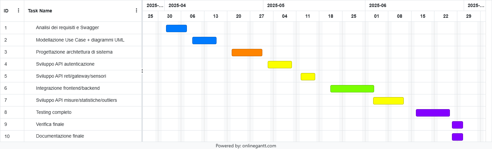

# Stima del Progetto

Data: 19 Apr 2025

Versione: 1.0

## Approccio alla stima

Si considera lo sviluppo del progetto GeoControl come descritto nello Swagger, **partendo da zero** e **indipendentemente dalle scadenze accademiche**.

## Stima per dimensione

|                                                                                             | **Stima**     |
| ------------------------------------------------------------------------------------------- | ------------- |
| **NC** = Numero stimato di classi da sviluppare                                             | 22            |
| **A** = Dimensione media stimata per classe, in LOC (Linee di Codice)                       | 85            |
| **S** = Dimensione totale stimata del progetto, in LOC (= NC × A)                           | 1.870         |
| **E** = Sforzo stimato, in ore/uomo (produttività media: 10 LOC/ora/uomo)                   | 187           |
| **C** = Costo stimato, in euro (30 €/ora)                                                   | 5.610 €       |
| **Tempo di calendario stimato**, in settimane (Team di 4 persone, 8h/giorno, 5gg/settimana) | 1.2 settimane |

## Stima per decomposizione del prodotto

| **Componente**                                | **Sforzo stimato (ore/uomo)** |
| --------------------------------------------- | ----------------------------- |
| Documento dei requisiti                       | 12                            |
| Documento di design (diagrammi, architettura) | 16                            |
| Codice (Controller, Service, DTO)             | 100                           |
| Test unitari                                  | 14                            |
| Test delle API                                | 12                            |
| Documentazione gestionale/finale              | 8                             |

**Totale sforzo**: **162 ore/uomo**

## Stima per decomposizione delle attività

| Attività                               | **Sforzo stimato (ore/uomo)** |
| -------------------------------------- | ----------------------------- |
| Analisi Swagger e requisiti            | 12                            |
| Modellazione Use Case + UML            | 12                            |
| Progettazione System Design            | 16                            |
| Sviluppo autenticazione                | 12                            |
| Sviluppo reti/gateway/sensori          | 24                            |
| Sviluppo misure, statistiche, outliers | 28                            |
| Scrittura test (unitari + API)         | 16                            |
| Documentazione finale                  | 10                            |

**Totale sforzo**: **130 ore/uomo**

  

## Riepilogo delle stime

| **Metodo di stima**               | **Sforzo stimato** | **Durata stimata** |
| --------------------------------- | ------------------ | ------------------ |
| Stima per dimensione              | 187 h              | ~12 settimane      |
| Stima per decomposizione prodotto | 162 h              | ~11 settimane      |
| Stima per decomposizione attività | 130 h              | ~10 settimane      |

Le tre stime sono coerenti e convergono in un intervallo compreso tra **130 e 190 ore/uomo**, perfettamente compatibile con un progetto distribuito su **tre mesi accademici (aprile–giugno)**.

Il carico di lavoro risulta **equilibrato** e distribuito tra analisi, sviluppo, testing e documentazione, consentendo al team di lavorare in modo iterativo e progressivo.

Le ipotesi si basano su un team di 4 persone, con disponibilità regolare, e una produttività media di **10 LOC/h**.