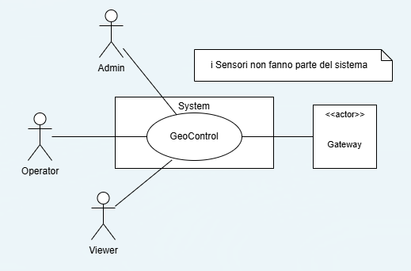
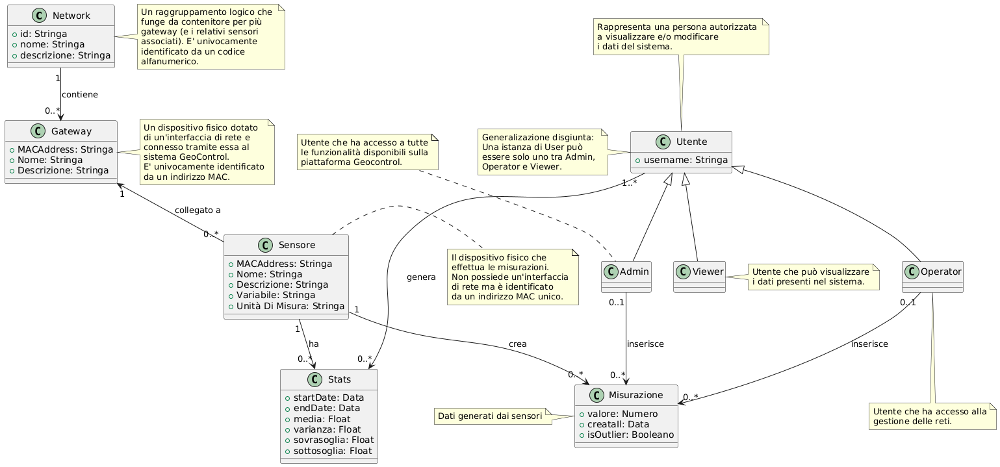
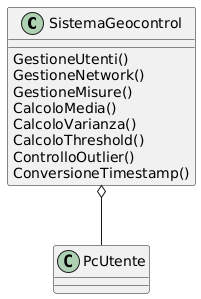
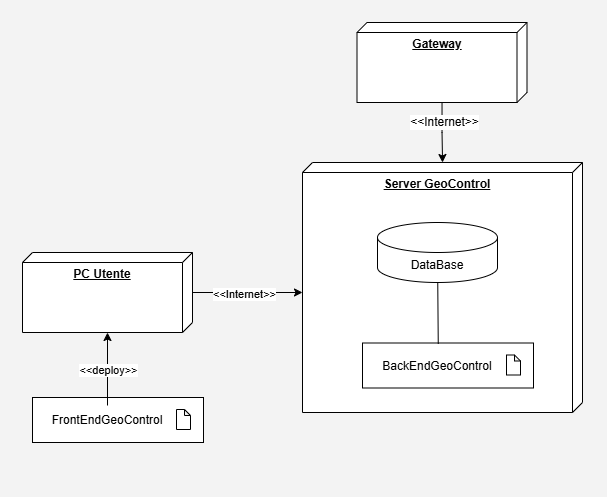

# Documento dei Requisiti - GeoControl

**Data**: 19 Apr 2025

**Versione**: V1 - Descrizione di GeoControl in base allo Swagger

| **Numero Versione** |                     **Cambiamenti**                     |
| :-----------------: | :-----------------------------------------------------: |
|        1.0.1        |          Aggiunta Business Model & Stakeholder          |
|        1.0.2        | Aggiunta Context Diagram, Interfacce & Storie e persone |
|        1.0.3        |              Aggiunta Requisiti funzionali              |
|        1.0.4        |            Aggiunta Requisiti non funzionali            |
|        1.0.5        |         Aggiunta Diagramma Use Case e Use Cases         |
|        1.0.6        |                   Aggiunta Glossario                    |
|        1.0.7        |                   Aggiunta Deployment                   |
|        1.0.8        |                 Aggiunta System Design                  |

# Tabella dei Contenuti

- [Documento dei Requisiti - GeoControl](#documento-dei-requisiti---geocontrol)
- [Tabella dei Contenuti](#tabella-dei-contenuti)
- [Descrizione informale](#descrizione-informale)
- [Business Model](#business-model)
- [Stakeholders](#stakeholders)
- [Context Diagram e Interfacce](#context-diagram-e-interfacce)
  - [Context Diagram](#context-diagram)
  - [Interfacce](#interfacce)
- [Storie e persone](#storie-e-persone)
- [Requisiti funzionali e non funzionali](#requisiti-funzionali-e-non-funzionali)
  - [Requisiti funzionali](#requisiti-funzionali)
  - [Requisiti non funzionali](#requisiti-non-funzionali)
- [Diagramma Use Case e Use Cases](#diagramma-use-case-e-use-cases)
  - [Digramma Use Case](#digramma-use-case)
  - [Use Case UC1 - Accesso](#use-case-uc1---accesso)
    - [Scenario S1.1 - Accesso effettuato con successo](#scenario-s11---accesso-effettuato-con-successo)
    - [Scenario S1.2 - Input errato](#scenario-s12---input-errato)
    - [Scenario S1.3 - Invalid username](#scenario-s13---invalid-username)
    - [Scenario S1.4 - User not found](#scenario-s14---user-not-found)
    - [Scenario S1.5 - Internal server error](#scenario-s15---internal-server-error)
  - [Use Case UC2 - Visualizzazione elenco utenti registrati](#use-case-uc2---visualizzazione-elenco-utenti-registrati)
    - [Scenario S2.1 - Elenco utenti visualizzato con successo](#scenario-s21---elenco-utenti-visualizzato-con-successo)
    - [Scenario S2.2 - Unauthorized](#scenario-s22---unauthorized)
    - [Scenario S2.3 - Insufficient Rights](#scenario-s23---insufficient-rights)
    - [Scenario S2.4 - Internal server error](#scenario-s24---internal-server-error)
  - [Use Case UC3 - Registrazione di un nuovo utente](#use-case-uc3---registrazione-di-un-nuovo-utente)
    - [Scenario S3.1 - Inserimento completato con successo](#scenario-s31---inserimento-completato-con-successo)
    - [Scenario S3.2 - Input errato](#scenario-s32---input-errato)
    - [Scenario S3.3 - Utente non autorizzato](#scenario-s33---utente-non-autorizzato)
    - [Scenario S3.4 - Diritti non sufficienti](#scenario-s34---diritti-non-sufficienti)
    - [Scenario S3.5 - Username già preso](#scenario-s35---username-già-preso)
    - [Scenario S3.6 - Internal server error](#scenario-s36---internal-server-error)
  - [Use Case UC4 - Visualizzazione dettagli di un utente registrato](#use-case-uc4---visualizzazione-dettagli-di-un-utente-registrato)
    - [Scenario S4.1 - Restituisce l’utente richiesto](#scenario-s41---restituisce-lutente-richiesto)
    - [Scenario S4.2 - Utente non autorizzato](#scenario-s42---utente-non-autorizzato)
    - [Scenario S4.3 - Diritti non sufficienti](#scenario-s43---diritti-non-sufficienti)
    - [Scenario S4.4 - Utente non trovato](#scenario-s44---utente-non-trovato)
    - [Scenario S4.5 - Internal Server Error](#scenario-s45---internal-server-error)
  - [Use Case UC5 – Cancellazione di un utente](#use-case-uc5--cancellazione-di-un-utente)
    - [Scenario S5.1 – Cancellazione di un utente completata con successo](#scenario-s51--cancellazione-di-un-utente-completata-con-successo)
    - [Scenario S5.2 – Token non valido](#scenario-s52--token-non-valido)
    - [Scenario S5.3 – Privilegi insufficienti](#scenario-s53--privilegi-insufficienti)
    - [Scenario S5.4 – Utente non trovato](#scenario-s54--utente-non-trovato)
    - [Scenario S5.5 – Errore interno del server](#scenario-s55--errore-interno-del-server)
  - [Use Case UC6 - Visualizzazione elenco di tutti i networks](#use-case-uc6---visualizzazione-elenco-di-tutti-i-networks)
    - [Scenario S6.1 - Elenco network visualizzato con successo](#scenario-s61---elenco-network-visualizzato-con-successo)
    - [Scenario S6.2 - Unauthorized](#scenario-s62---unauthorized)
    - [Scenario S6.3 - Internal server error](#scenario-s63---internal-server-error)
  - [Use Case UC7 - Creazione di un nuovo network](#use-case-uc7---creazione-di-un-nuovo-network)
    - [Scenario S7.1 - Network creato con successo](#scenario-s71---network-creato-con-successo)
    - [Scenario S7.2 - Dati input non validi](#scenario-s72---dati-input-non-validi)
    - [Scenario S7.3 - Token non valido](#scenario-s73---token-non-valido)
    - [Scenario S7.4 - Privileggi insufficienti](#scenario-s74---privileggi-insufficienti)
    - [Scenario S7.5 - Network code già esistente](#scenario-s75---network-code-già-esistente)
    - [Scenario S7.6 - Errore interno del server](#scenario-s76---errore-interno-del-server)
  - [Use Case UC8 - Visualizzazione di un network specifico](#use-case-uc8---visualizzazione-di-un-network-specifico)
    - [Scenario S8.1 - Dettagli network visualizzati con successo](#scenario-s81---dettagli-network-visualizzati-con-successo)
    - [Scenario S8.2 - Unauthorized](#scenario-s82---unauthorized)
    - [Scenario S8.3 - Network not found](#scenario-s83---network-not-found)
    - [Scenario S8.4 - Internal server error](#scenario-s84---internal-server-error)
  - [Use Case UC9 - Modifica di un network](#use-case-uc9---modifica-di-un-network)
    - [Scenario S9.1 - Network modificato con successo](#scenario-s91---network-modificato-con-successo)
    - [Scenario S9.2 - Dati input non validi](#scenario-s92---dati-input-non-validi)
    - [Scenario S9.3 - Token non valido](#scenario-s93---token-non-valido)
    - [Scenario S9.4 - Privileggi insufficienti](#scenario-s94---privileggi-insufficienti)
    - [Scenario S9.5 - Network non trovato](#scenario-s95---network-non-trovato)
    - [Scenario S9.6 - Network code già esistente](#scenario-s96---network-code-già-esistente)
    - [Scenario S9.7 - Errore interno del server](#scenario-s97---errore-interno-del-server)
  - [Use Case UC10 - Eliminazione di un network](#use-case-uc10---eliminazione-di-un-network)
    - [Scenario S10.1 - Network eliminato con successo](#scenario-s101---network-eliminato-con-successo)
    - [Scenario S10.2 - Token non valido](#scenario-s102---token-non-valido)
    - [Scenario S10.3 - Privileggi insufficienti](#scenario-s103---privileggi-insufficienti)
    - [Scenario S10.4 - Network non trovato](#scenario-s104---network-non-trovato)
    - [Scenario S10.5 - Errore interno del server](#scenario-s105---errore-interno-del-server)
  - [Use Case UC11 - Visualizzazione elenco di tutti i gateways **appartenenti ad un network specifico**](#use-case-uc11---visualizzazione-elenco-di-tutti-i-gateways-appartenenti-ad-un-network-specifico)
    - [Scenario S11.1 - Visualizzazione di tutti i gateway](#scenario-s111---visualizzazione-di-tutti-i-gateway)
    - [Scenario S11.2 - Non autorizzato](#scenario-s112---non-autorizzato)
    - [Scenario S11.3 - Il network specificato non esiste](#scenario-s113---il-network-specificato-non-esiste)
    - [Scenario S11.4 - Internal Server Error](#scenario-s114---internal-server-error)
  - [Use Case UC12 - Aggiunta di un nuovo gateway](#use-case-uc12---aggiunta-di-un-nuovo-gateway)
    - [Scenario S12.1 - Gateway aggiunto con successo](#scenario-s121---gateway-aggiunto-con-successo)
    - [Scenario S12.2 - Invalid input data](#scenario-s122---invalid-input-data)
    - [Scenario S12.3 - Unauthorized](#scenario-s123---unauthorized)
    - [Scenario S12.4 - Insufficient rights](#scenario-s124---insufficient-rights)
    - [Scenario S12.5 - Network not found](#scenario-s125---network-not-found)
    - [Scenario S12.6 - Gateway MAC address already in use](#scenario-s126---gateway-mac-address-already-in-use)
    - [Scenario S12.7 - Internal server error](#scenario-s127---internal-server-error)
  - [Use Case UC13 - Visualizzazione di un gateway specifico](#use-case-uc13---visualizzazione-di-un-gateway-specifico)
    - [Scenario S13.1 - Visualizzazione del gateway](#scenario-s131---visualizzazione-del-gateway)
    - [Scenario S13.2 - Non autorizzato](#scenario-s132---non-autorizzato)
    - [Scenario S13.3 - Network non trovato](#scenario-s133---network-non-trovato)
    - [Scenario S13.4 - Gateway non trovato](#scenario-s134---gateway-non-trovato)
    - [Scenario S13.5 - Internal Server Error](#scenario-s135---internal-server-error)
  - [Use Case UC14 - Modifica di un Gateway](#use-case-uc14---modifica-di-un-gateway)
    - [Scenario S14.1 - Modifica di un Gateway riuscito](#scenario-s141---modifica-di-un-gateway-riuscito)
    - [Scenario S14.2 - Dati input non validi](#scenario-s142---dati-input-non-validi)
    - [Scenario S14.3 - Token non valido](#scenario-s143---token-non-valido)
    - [Scenario S14.4 - Privilegi insufficienti](#scenario-s144---privilegi-insufficienti)
    - [Scenario 14.5 - Network o Gateway non trovati](#scenario-145---network-o-gateway-non-trovati)
    - [Scenario S14.6 - MAC address già esistente](#scenario-s146---mac-address-già-esistente)
    - [Scenario S14.7 - Errore interno del server](#scenario-s147---errore-interno-del-server)
  - [Use Case UC15 - Eliminazione di un Gateway](#use-case-uc15---eliminazione-di-un-gateway)
    - [Scenario S15.1 - Eliminazione Gateway riuscita](#scenario-s151---eliminazione-gateway-riuscita)
    - [Scenario S15.2 - Token non valido](#scenario-s152---token-non-valido)
    - [Scenario S15.3 - Privilegi insufficienti](#scenario-s153---privilegi-insufficienti)
    - [Scenario S15.4 - Network o Gateway non trovato](#scenario-s154---network-o-gateway-non-trovato)
    - [Scenario S15.5 - Errore interno del server](#scenario-s155---errore-interno-del-server)
  - [Use Case UC16 - Visualizzazione elenco di tutti i sensori appartenenti ad un gateway di uno specifico network](#use-case-uc16---visualizzazione-elenco-di-tutti-i-sensori-appartenenti-ad-un-gateway-di-uno-specifico-network)
    - [Scenario S16.1 - Visualizzazione di tutti i sensori](#scenario-s161---visualizzazione-di-tutti-i-sensori)
    - [Scenario S16.2 - Non autorizzato](#scenario-s162---non-autorizzato)
    - [Scenario S16.3 - Network non trovato](#scenario-s163---network-non-trovato)
    - [Scenario S16.4 - Gateway non trovato](#scenario-s164---gateway-non-trovato)
    - [Scenario S16.5 - Internal Server Error](#scenario-s165---internal-server-error)
  - [Use Case UC17 - Aggiunta di un nuovo sensore **appartenente ad un gateway di uno specifico network**](#use-case-uc17---aggiunta-di-un-nuovo-sensore-appartenente-ad-un-gateway-di-uno-specifico-network)
    - [Scenario S17.1 - Inserimento del nuovo sensore](#scenario-s171---inserimento-del-nuovo-sensore)
    - [Scenario S17.2 - Invalid input data](#scenario-s172---invalid-input-data)
    - [Scenario S17.3 - Non autorizzato](#scenario-s173---non-autorizzato)
    - [Scenario S17.4 - Diritti non sufficienti](#scenario-s174---diritti-non-sufficienti)
    - [Scenario S17.5 - Il network e/o il gateway non esistono](#scenario-s175---il-network-eo-il-gateway-non-esistono)
    - [Scenario S17.6 - Il MAC immesso per il sensore è già in uso](#scenario-s176---il-mac-immesso-per-il-sensore-è-già-in-uso)
    - [Scenario S17.7 - Internal Server Error](#scenario-s177---internal-server-error)
  - [Use Case UC18 – Visualizzazione di un Sensore specifico](#use-case-uc18--visualizzazione-di-un-sensore-specifico)
    - [Scenario S18.1 – Visualizzazione sensore riuscita](#scenario-s181--visualizzazione-sensore-riuscita)
    - [Scenario S18.2 – Utente non autenticato](#scenario-s182--utente-non-autenticato)
    - [Scenario S18.3 – Risorsa non trovata](#scenario-s183--risorsa-non-trovata)
    - [Scenario S18.4 – Errore interno del server](#scenario-s184--errore-interno-del-server)
  - [Use Case UC19 – Modifica di un sensore](#use-case-uc19--modifica-di-un-sensore)
    - [Scenario S19.1 – Modifica di un sensore esistente riuscito](#scenario-s191--modifica-di-un-sensore-esistente-riuscito)
    - [Scenario S19.2 – Dati input non validi](#scenario-s192--dati-input-non-validi)
    - [Scenario S19.3 – Token non valido](#scenario-s193--token-non-valido)
    - [Scenario S19.4 – Privilegi insufficienti](#scenario-s194--privilegi-insufficienti)
    - [Scenario S19.5 – Risorsa non trovata](#scenario-s195--risorsa-non-trovata)
    - [Scenario S19.6 – MAC address già esistente](#scenario-s196--mac-address-già-esistente)
    - [Scenario S19.7 – Errore interno del server](#scenario-s197--errore-interno-del-server)
  - [Use Case UC20 – Eliminazione di un Sensore](#use-case-uc20--eliminazione-di-un-sensore)
    - [Scenario S20.1 – Eliminazione sensore riuscita](#scenario-s201--eliminazione-sensore-riuscita)
    - [Scenario S20.2 – Token non valido](#scenario-s202--token-non-valido)
    - [Scenario S20.3 – Privilegi insufficienti](#scenario-s203--privilegi-insufficienti)
    - [Scenario S20.4 – Risorsa non trovata](#scenario-s204--risorsa-non-trovata)
    - [Scenario S20.5 – Errore interno del server](#scenario-s205--errore-interno-del-server)
  - [Use Case UC21 - Visualizzazione misure da un set di sensori](#use-case-uc21---visualizzazione-misure-da-un-set-di-sensori)
    - [Scenario S21.1 - Misure visualizzate con successo](#scenario-s211---misure-visualizzate-con-successo)
    - [Scenario S21.2 - Conversione timestamp in fuso locale](#scenario-s212---conversione-timestamp-in-fuso-locale)
    - [Scenario S21.3 - Unauthorized](#scenario-s213---unauthorized)
    - [Scenario S21.4 - Network not found](#scenario-s214---network-not-found)
    - [Scenario S21.5 - Internal server error](#scenario-s215---internal-server-error)
  - [Use Case UC22 - Visualizzazione statistiche da un set di sensori](#use-case-uc22---visualizzazione-statistiche-da-un-set-di-sensori)
    - [Scenario 22.1 - Statistiche visualizzate con successo](#scenario-221---statistiche-visualizzate-con-successo)
    - [Scenario S22.2 - Conversione timestamp in fuso orario locale](#scenario-s222---conversione-timestamp-in-fuso-orario-locale)
    - [Scenario 22.3 - Token non valido](#scenario-223---token-non-valido)
    - [Scenario 22.4 - Network non trovato](#scenario-224---network-non-trovato)
    - [Scenario 22.5 - Errore interno del server](#scenario-225---errore-interno-del-server)
  - [Use Case UC23 - Visualizzazione outliers da un set di sensori](#use-case-uc23---visualizzazione-outliers-da-un-set-di-sensori)
    - [Scenario 23.1 - Outliers visualizzati con successo](#scenario-231---outliers-visualizzati-con-successo)
    - [Scenario S23.2 - Conversione timestamp in fuso orario locale](#scenario-s232---conversione-timestamp-in-fuso-orario-locale)
    - [Scenario 23.3 - Token non valido](#scenario-233---token-non-valido)
    - [Scenario 23.4 - Network non trovato](#scenario-234---network-non-trovato)
    - [Scenario 23.5 - Errore interno del server](#scenario-235---errore-interno-del-server)
  - [Use Case UC24 - Memorizzazione misure ottenute da uno specifico sensore](#use-case-uc24---memorizzazione-misure-ottenute-da-uno-specifico-sensore)
    - [Scenario 24.1 - Misure memorizzate con successo](#scenario-241---misure-memorizzate-con-successo)
    - [Scenario 24.2 - Dati input non validi](#scenario-242---dati-input-non-validi)
    - [Scenario 24.3 - Token non valido](#scenario-243---token-non-valido)
    - [Scenario 24.4 - Privileggi insufficienti](#scenario-244---privileggi-insufficienti)
    - [Scenario 24.5 - Network/Gateway/Sensore non trovato](#scenario-245---networkgatewaysensore-non-trovato)
    - [Scenario 24.6 - Errore interno del server](#scenario-246---errore-interno-del-server)
  - [Use Case UC25 - Visualizzazione misure da uno specifico sensore](#use-case-uc25---visualizzazione-misure-da-uno-specifico-sensore)
    - [Scenario S25.1 - Misure visualizzate con successo](#scenario-s251---misure-visualizzate-con-successo)
    - [Scenario S25.2 - Conversione timestamp in fuso locale](#scenario-s252---conversione-timestamp-in-fuso-locale)
    - [Scenario S25.3 - Unauthorized](#scenario-s253---unauthorized)
    - [Scenario S25.4 - Network/Gateway/Sensor not found](#scenario-s254---networkgatewaysensor-not-found)
    - [Scenario S25.5 - Internal server error](#scenario-s255---internal-server-error)
  - [Use Case UC26 - Visualizzazione statistiche da uno specifico sensore](#use-case-uc26---visualizzazione-statistiche-da-uno-specifico-sensore)
    - [Scenario 26.1 - Statistiche visualizzate con successo](#scenario-261---statistiche-visualizzate-con-successo)
    - [Scenario S26.2 - Conversione timestamp in fuso orario locale](#scenario-s262---conversione-timestamp-in-fuso-orario-locale)
    - [Scenario 26.3 - Token non valido](#scenario-263---token-non-valido)
    - [Scenario 26.4 - Network non trovato](#scenario-264---network-non-trovato)
    - [Scenario 26.5 - Errore interno del server](#scenario-265---errore-interno-del-server)
  - [Use Case UC27 - Visualizzazione outliers da uno specifico sensore](#use-case-uc27---visualizzazione-outliers-da-uno-specifico-sensore)
    - [Scenario S27.1 - Visualizzazione di tutti gli outlier](#scenario-s271---visualizzazione-di-tutti-gli-outlier)
    - [Scenario S27.2 - Conversione timestamp in fuso orario locale](#scenario-s272---conversione-timestamp-in-fuso-orario-locale)
    - [Scenario S27.3 - Non autorizzato](#scenario-s273---non-autorizzato)
    - [Scenario S27.4 - Network/Gateway/Sensor non trovati](#scenario-s274---networkgatewaysensor-non-trovati)
    - [Scenario S27.5 - Internal Server Error](#scenario-s275---internal-server-error)
- [Glossario](#glossario)
- [System Design](#system-design)
- [Deployment Diagram](#deployment-diagram)
    - [Componenti](#componenti)
    - [Connessioni](#connessioni)

# Descrizione informale

GeoControl è un sistema software progettato per il monitoraggio di variabili fisiche e ambientali in diversi contesti: dalle analisi idrogeologiche di aree montane alla sorveglianza di edifici storici, fino al controllo di parametri interni (come temperatura o illuminazione) in ambienti residenziali o lavorativi.
GeoControl è un sistema software progettato per il monitoraggio di variabili fisiche e ambientali in diversi contesti: dalle analisi idrogeologiche di aree montane alla sorveglianza di edifici storici, fino al controllo di parametri interni (come temperatura o illuminazione) in ambienti residenziali o lavorativi.

# Business Model

GeoControl è un sistema software in grado di monitorare diversi elementi ambientali con lo scopo di poter studiare le condizioni di determinate aree e prevenirne i rischi. Il servizio si propone di acquisire dati in tempo reale con accuratezza, indicare se sono valori accettabili che non superano una certa soglia (outliers) e fornirli a coloro che usufruiranno del software. Il sistema dispone dei dati di molte variabili ambientali come l’analisi idrogeologica delle aree montane ma sono anche presenti misurazioni di parametri interni come la temperatura e la luminosità di ambienti lavorativi. Proprio per quest’ultima features GeoContorl può anche essere utilizzata per il monitoraggio di strutture storiche.

GeoControl è un software commissionato dall’UMC della regione Piemonte per fornire alle aziende pubbliche di monitoraggio un sistema in grado di raccogliere tutte le misure necessarie alle analisi territoriali e strutturali. Il servizio, inoltre, è disponibile a tutte le aziende o società private che hanno interesse per questi dati come, per esempio, imprese edili.

Il servizio è gestito da Admin che hanno il pieno controllo del software e l’accesso a tutte le risorse, inclusa la gestione dei network e degli utenti. Insieme a loro, sono presenti altre figure denominate Operator che gestiscono il software dei network, dei gateway e dei sensori: hanno il compito di implementarlo ed effettuare manutenzioni programmate.

GeoControl utilizza strutture hardware gia pre-esistenti per registrare i dati. Sensori costruiti e installati sul territorio da aziende terze invieranno i dati e il momento della misurazione a dei gateway che convertiranno le misure e calcoleranno tutti i paramentri finali. Quest’ultimi saranno inviati al servizio Geocontrol tramite interfacce network collegate ad ogni gateway.

Tramite registrazione, e successiva validazione, della propria azienda è possibile accedere a tutti i dati disponibili in tempo reale fornendo i parametri, la data e l’orario (timestamp) della misurazione.

GeoControl adotta un modello Software-as-a-Service (SaaS), dopo la registrazione di un utente, si dovrà sottoscrivere un abbonamento per accedere ai dati. Sono disponibili tre tipi di abbonamento: trimestrale, semestrale o annuale. Coloro che usufruiscono dell’abbonamento annuale avranno degli sconti sul prezzo.

# Stakeholders

| **Stakeholder**     | **Interesse**                                                                                                      |
| ------------------- | ------------------------------------------------------------------------------------------------------------------ |
| Azienda di sviluppo | Sviluppare il software GeoControl                                                                                  |
| Admin               | Gestire la parte relativa al network e agli utenti                                                                 |
| Operator            | Implementare il software nei sensori e nei gateway e gestire le misurazioni e la manutenzione della parte hardware |
| Viewer              | Accedere e visualizzare i dati d’interesse successivamente alla fase di registrazione                              |
| Ente utilizzatore   | Utilizza il software per eseguire analisi relative alle misure territoriali di suo interesse                       |

# Context Diagram e Interfacce

## Context Diagram

  

## Interfacce

| **Attori**   | **Interfaccia Logica**                                              | **Interfaccia fisica** |
| ------------ | ------------------------------------------------------------------- | ---------------------- |
| **Admin**    | GUI per la gestione degli utenti, delle reti, dei sensori e gateway | PC                     |
| **Viewer**   | GUI per la consultazione di dati ambientali, statistiche e report   | PC, Smartphone         |
| **Operator** | GUI per la registrazione e configurazione di sensori e gateway      | PC                     |
| **Gateway**  | API di invio dati                                                   | Interfaccia di rete    |

# Storie e persone

Una **Persona** è una rappresentazione immaginaria di un tipo di utente che interagisce con il sistema. Viene utilizzata per identificare e comprendere meglio i diversi profili degli utenti finali, includendo caratteristiche, obiettivi e comportamenti tipici. Ogni Persona funge da modello per un attore specifico.

Una **Storia** descrive una funzionalità o un'esigenza del sistema dal punto di vista dell’utente. È una forma semplice e diretta per esprimere i requisiti, solitamente articolata nella forma: “Come [**persona**], desidero [**funzionalità o azione**], affinché [**risultato atteso**]". Le storie aiutano a mantenere l'attenzione sull’esperienza dell’utente e sugli scopi da raggiungere.

Nel nostro caso possiamo individuare le seguenti Persone con le relative Storie:

- **Persona 1**: Mezza età, maschio, dipendente presso azienda di edilizia
  - **Storia**: ha interesse a monitorare i dati riferiti ad attività sismiche in una determinata area tramite software sia per progetti futuri che per edifici storici. Tramite l'interfaccia web, consulta le misurazioni, le statistiche storiche temperatura ed umidità di edifici.
- **Persona 2**: Giovane, femmina, dipendente di UMC Piemonte
  - **Storia**: vuole monitorare i dati delle zone a rischio idrogeologico. Analizza le serie temporali di umidità, piovosità e movimento del terreno, confrontando i dati in tempo reale con quelli storici.
- **Persona 3**: Mezza età, femmina, tecnico installatore e manutentore presso azienda di sensori
  - **Storia**: dopo aver montato fisicamente sensori e gateway in campo, accede alla piattaforma per registrare i dispositivi installati nel sistema. Inserisce i relativi MAC address, li associa alla rete corretta e verifica il corretto invio dei dati.
- **Persona 4:** mezza età, maschio, developer dell'ente sviluppatore
  - **Storia:** supervisiona l'intera infrastruttura software e si occupa della gestione degli utenti e delle reti. Inoltre, aggiorna il sistema e ne migliora le funzionalità per garantire la scalabilità e la sicurezza della piattaforma.

# Requisiti funzionali e non funzionali

## Requisiti funzionali

I _requisiti funzionali_ sono i requisiti che il sistema deve essere in grado di soddisfare per essere considerato accettabile.

| **ID**    | **Descrizione**                                                                              |
| --------- | -------------------------------------------------------------------------------------------- |
| **_FR1_** | **_Autenticazione & Gestione Utente_**                                                       |
| FR1.1     | Accesso                                                                                      |
| FR1.2     | Registrazione di un nuovo utente                                                             |
| FR1.3     | Cancellazione di un utente                                                                   |
| FR1.4     | Visualizzazione schermata di accesso                                                         |
| FR1.5     | Visualizzazione elenco utenti registrati                                                     |
| FR1.6     | Visualizzazione dettagli di un utente registrato                                             |
| **_FR2_** | **_Topologia - Network_**                                                                    |
| FR2.1     | Visualizzazione elenco di tutti i networks                                                   |
| FR2.2     | Visualizzazione di un network specifico                                                      |
| FR2.3     | Creazione di un nuovo network                                                                |
| FR2.4     | Modifica di un network                                                                       |
| FR2.5     | Eliminazione di un network                                                                   |
| **_FR3_** | **_Topologia - Gateway appartenenti ad un network specifico_**                               |
| FR3.1     | Visualizzazione elenco di tutti i gateways                                                   |
| FR3.2     | Visualizzazione di un gateway specifico                                                      |
| FR3.3     | Aggiunta di un nuovo gateway                                                                 |
| FR3.4     | Modifica di un gateway                                                                       |
| FR3.5     | Eliminazione di un gateway                                                                   |
| **_FR4_** | **_Topologia - Sensore appartenente ad un gateway di uno specifico network_**                |
| FR4.1     | Visualizzazione elenco di tutti i sensori                                                    |
| FR4.2     | Visualizzazione di un sensore specifico                                                      |
| FR4.3     | Aggiunta di un nuovo sensore                                                                 |
| FR4.4     | Modifica di un sensore                                                                       |
| FR4.5     | Eliminazione di un sensore                                                                   |
| **_FR5_** | **_Misure, Statistiche, Outliers & Calcoli - Ottenute da sensori di uno specifico network_** |
| FR5.1     | Calcolo media e varianza e soglie minime/massime sulle misure eventualmente filtrate         |
| FR5.2     | Visualizzazione misure eventualmente filtrate                                                |
| FR5.2.1   | Visualizzazione misure da un set di sensori                                                  |
| FR5.2.2   | Visualizzazione misure da uno specifico sensore                                              |
| FR5.2.3   | Visualizzazione misure con supporto alla conversione del timestamp UTC in fuso locale        |
| FR5.3     | Visualizzazione statistiche eventualmente filtrate                                           |
| FR5.3.1   | Visualizzazione statistiche da un set di sensori                                             |
| FR5.3.2   | Visualizzazione statistiche da uno specifico sensore                                         |
| FR5.3.3   | Visualizzazione statistiche con supporto alla conversione del timestamp UTC in fuso locale   |
| FR5.4     | Visualizzazione outliers eventualmente filtrati                                              |
| FR5.4.1   | Individuazione outliers (misure fuori soglia minima o massima)                               |
| FR5.4.2   | Visualizzazione outliers da un set di sensori                                                |
| FR5.4.3   | Visualizzazione outliers da uno specifico sensore                                            |
| FR5.4.4   | Visualizzazione outliers con supporto alla conversione del timestamp UTC in fuso locale      |
| FR5.5     | Memorizzazione misure ottenute da uno specifico sensore                                      |

## Requisiti non funzionali

I **_requisiti non funzionali_** rappresentano condizioni o caratteristiche che definiscono la qualità complessiva di un sistema, senza entrare nel merito delle funzionalità specifiche che esso offre.

| **Nome** | **Tipo**     | **Descrizione**                                                                                                                | **Requisito funzionale a cui si riferisce** |
| -------- | ------------ | ------------------------------------------------------------------------------------------------------------------------------ | ------------------------------------------- |
| NFR1     | Sicurezza    | Il sistema deve richiedere autenticazione e generare un token che verrà utilizzato per le successive interazioni con il server | FR1                                         |
| NFR2     | Sicurezza    | Le API devono essere disponibili soltanto ai ruoli che ne hanno diritto ad utilizzarle                                         | FR1                                         |
| NFR3     | Sicurezza    | I dati (sia utente sia delle reti) non devono essere accessibili a tipi di utenti non autorizzati                              | Tutti                                       |
| NFR4     | Affidabilità | I sensori non devono perdere più di 6 misurazioni all’anno                                                                     | FR5                                         |
| NFR5     | Usabilità    | Il sensore deve effettuare una misurazione ogni 10 minuti                                                                      | FR4                                         |
| NFR6     | Usabilità    | Tutti i timestamp devono essere memorizzati dal sistema in formato ISO 8601 UTC                                                | FR4                                         |
| NFR7     | Usabilità    | Compatibilità con diversi modelli di sensori, gateway e protocolli di comunicazione                                            | FR2, FR3, FR4                               |

# Diagramma Use Case e Use Cases

## Digramma Use Case

## Use Case UC1 - Accesso

| **Attori coinvolti**  | Admin, Operator, Viewer                              |
| --------------------- | ---------------------------------------------------- |
| **Precondizione**     | L’utente ha un account                               |
| **Postcondizione**    | L’utente è autenticato come Admin, Operator o Viewer |
| **Scenario Nominale** | S1.1                                                 |
| **Varianti**          | Nessuna                                              |
| **Eccezioni**         | S1.2, S1.3, S1.4, S1.5                               |

### Scenario S1.1 - Accesso effettuato con successo

| **Precondizione**  | L’utente ha un account                                                                       |
| ------------------ | -------------------------------------------------------------------------------------------- |
| **Postcondizione** | L’utente è autenticato come Admin, Operator o Viewer                                         |
| **Step#**          | **Descrizione**                                                                              |
| 1                  | Utente: Accede alla schermata di login, inserisce le credenziali e invia una richiesta       |
| 2                  | Sistema: Verifica i parametri della richiesta: Validi                                        |
| 3                  | Sistema: Associa un token e lo restituisce nel corpo di una risposta con codice **200 (OK)** |
| 4                  | Viene visualizzata la schermata principale del servizio                                      |

### Scenario S1.2 - Input errato

| **Precondizione**  | L’utente ha o non ha un account                                                        |
| ------------------ | -------------------------------------------------------------------------------------- |
| **Postcondizione** | L’utente non è autenticato e non ha accesso al sistema                                 |
| **Step#**          | **Descrizione**                                                                        |
| 1                  | Utente: Accede alla schermata di login, inserisce le credenziali e invia una richiesta |
| 2                  | Sistema: Verifica i parametri della richiesta: Input invalido                          |
| 3                  | Sistema: Restituisce risposta con codice **400 (Bad Request)**                         |
| 4                  | Viene visualizzata una schermata di errore                                             |

### Scenario S1.3 - Invalid username

| **Precondizione**  | L’utente ha un account                                                                 |
| ------------------ | -------------------------------------------------------------------------------------- |
| **Postcondizione** | L’utente non è autenticato e non ha accesso al sistema                                 |
| **Step#**          | **Descrizione**                                                                        |
| 1                  | Utente: Accede alla schermata di login, inserisce le credenziali e invia una richiesta |
| 2                  | Sistema: Verifica i parametri della richiesta: Credenziali invalide                    |
| 3                  | Sistema: Restituisce risposta con codice **401 (Unauthorized)**                        |
| 4                  | Viene visualizzata una schermata di errore                                             |

### Scenario S1.4 - User not found

| **Precondizione**  | L’utente non ha un account                                                             |
| ------------------ | -------------------------------------------------------------------------------------- |
| **Postcondizione** | L’utente non è autenticato e non ha accesso al sistema                                 |
| **Step#**          | **Descrizione**                                                                        |
| 1                  | Utente: Accede alla schermata di login, inserisce le credenziali e invia una richiesta |
| 2                  | Sistema: Verifica i parametri della richiesta: Non corrispondono ad alcun account      |
| 3                  | Sistema: Restituisce risposta con codice **404 (Not Found)**                           |
| 4                  | Viene visualizzata una schermata di errore                                             |

### Scenario S1.5 - Internal server error

| **Precondizione**  | Il sistema è in grado di gestire richieste                                             |
| ------------------ | -------------------------------------------------------------------------------------- |
| **Postcondizione** | L’utente non è autenticato e non ha accesso al sistema                                 |
| **Step#**          | **Descrizione**                                                                        |
| 1                  | Utente: Accede alla schermata di login, inserisce le credenziali e invia una richiesta |
| 2                  | Sistema: Riscontra un errore nell’elaborazione della richiesta                         |
| 3                  | Sistema: Restituisce risposta con codice **500 (Internal Server Error)**               |
| 4                  | Viene visualizzata una schermata di errore                                             |

## Use Case UC2 - Visualizzazione elenco utenti registrati

| **Attori coinvolti**  | Admin                                               |
| --------------------- | --------------------------------------------------- |
| **Precondizione**     | L’utente è autenticato come Admin                   |
| **Postcondizione**    | Viene visualizzato l’elenco degli utenti registrati |
| **Scenario Nominale** | S2.1                                                |
| **Varianti**          | Nessuna                                             |
| **Eccezioni**         | S2.2, S2.3, S2.4                                    |

### Scenario S2.1 - Elenco utenti visualizzato con successo

| **Precondizione**  | L’utente è autenticato come Admin                                                  |
| ------------------ | ---------------------------------------------------------------------------------- |
| **Postcondizione** | Viene visualizzato l’elenco degli utenti registrati                                |
| **Step#**          | **Descrizione**                                                                    |
| 1                  | Admin: Richiede l’accesso alla schermata di gestione utenti registrati             |
| 2                  | Sistema: Verifica il token: Valido                                                 |
| 3                  | Sistema: Restituisce l’elenco degli utenti in una risposta con codice **200 (OK)** |
| 4                  | Viene visualizzato l’elenco degli utenti registrati                                |

### Scenario S2.2 - Unauthorized

| **Precondizione**  | Il token è scaduto                                                     |
| ------------------ | ---------------------------------------------------------------------- |
| **Postcondizione** | Non viene visualizzato l’elenco degli utenti registrati                |
| **Step#**          | **Descrizione**                                                        |
| 1                  | Admin: Richiede l’accesso alla schermata di gestione utenti registrati |
| 2                  | Sistema: Verifica il token: Scaduto                                    |
| 3                  | Sistema: Restituisce risposta con codice **401 (Unauthorized)**        |
| 4                  | L’Admin viene reindirizzato alla schermata di login                    |

### Scenario S2.3 - Insufficient Rights

| **Precondizione**  | Il ruolo dell’utente autenticato non è Admin                            |
| ------------------ | ----------------------------------------------------------------------- |
| **Postcondizione** | Non viene visualizzato l’elenco degli utenti registrati                 |
| **Step#**          | **Descrizione**                                                         |
| 1                  | Utente: Richiede l’accesso alla schermata di gestione utenti registrati |
| 2                  | Sistema: Verifica il token: Valido ma associato a ruolo inferiore       |
| 3                  | Sistema: Restituisce risposta con codice **403 (Forbidden)**            |
| 4                  | Viene visualizzata una schermata di errore                              |

### Scenario S2.4 - Internal server error

| **Precondizione**  | Il sistema è in grado di gestire richieste                               |
| ------------------ | ------------------------------------------------------------------------ |
| **Postcondizione** | Non viene visualizzato l’elenco degli utenti registrati                  |
| **Step#**          | **Descrizione**                                                          |
| 1                  | Admin: Richiede l’accesso alla schermata di gestione utenti registrati   |
| 2                  | Sistema: Riscontra un errore nell’elaborazione della richiesta           |
| 3                  | Sistema: Restituisce risposta con codice **500 (Internal Server Error)** |
| 4                  | Viene visualizzata una schermata di errore                               |

## Use Case UC3 - Registrazione di un nuovo utente

| **Attori coinvolti**  | Admin                                     |
| --------------------- | ----------------------------------------- |
| **Precondizione**     | L’utente che chiama questa API è un Admin |
| **Postcondizione**    | Viene aggiunto un nuovo utente            |
| **Scenario nominale** | S3.1                                      |
| **Varianti**          | Nessuna                                   |
| **Eccezioni**         | S3.2, S3.3, S3.4, S3.5, S3.6              |

### Scenario S3.1 - Inserimento completato con successo

| **Precondizione**  | L’utente che chiama questa API è un Admin                                                                        |
| ------------------ | ---------------------------------------------------------------------------------------------------------------- |
| **Postcondizione** | Viene aggiunto un nuovo utente                                                                                   |
| **Step#**          | **Descrizione**                                                                                                  |
| 1                  | Admin: Nella schermata di inserimento utente compila il form inserendo utente, password e ruolo del nuovo utente |
| 2                  | Sistema: Verifica che il token sia valido e corrisponda al ruolo Admin Il token soddisfa tali richieste          |
| 3                  | Sistema: Legge username, password e ruolo del nuovo utente inseriti nel body della chiamata                      |
| 5                  | Sistema: Verifica che lo username è unico. L’username non è mai stato usato                                      |
| 6                  | Sistema: Il nuovo utente viene registrato.                                                                       |

### Scenario S3.2 - Input errato

| **Precondizione**  | L’utente che chiama questa API è un Admin                                                                        |
| ------------------ | ---------------------------------------------------------------------------------------------------------------- |
| **Postcondizione** | Inserimento fallito                                                                                              |
| **Step#**          | **Descrizione**                                                                                                  |
| 1                  | Admin: Nella schermata di inserimento utente compila il form inserendo utente, password e ruolo del nuovo utente |
| 2                  | Sistema: Verifica che il token sia valido e corrisponda al ruolo Admin Il token soddisfa tali richieste          |
| 3                  | Sistema: Legge username, password e ruolo del nuovo utente inseriti nel body della chiamata                      |
| 4                  | Sistema: Si accorge che non tutti i parametri sono stati riempiti. Restituisce **errore 400**                    |

### Scenario S3.3 - Utente non autorizzato

| **Precondizione**  | L’utente che chiama questa API è un Admin                                                                         |
| ------------------ | ----------------------------------------------------------------------------------------------------------------- |
| **Postcondizione** | Inserimento fallito                                                                                               |
| **Step#**          | **Descrizione**                                                                                                   |
| 1                  | Admin: Nella schermata di inserimento utente compila il form inserendo utente, password e ruolo del nuovo utente. |
| 2                  | Sistema: Verifica che il token sia valido e corrisponda al ruolo Admin. Il token non esiste.                      |
| 6                  | Sistema: Annulla la procedura e restituisce **errore 401**                                                        |

### Scenario S3.4 - Diritti non sufficienti

| **Precondizione**  | L’utente che chiama questa API è un Admin                                                                                           |
| ------------------ | ----------------------------------------------------------------------------------------------------------------------------------- |
| **Postcondizione** | Inserimento fallito                                                                                                                 |
| **Step#**          | **Descrizione**                                                                                                                     |
| 1                  | Admin: Nella schermata di inserimento utente compila il form inserendo utente, password e ruolo del nuovo utente.                   |
| 2                  | Sistema: Verifica che il token sia valido e corrisponda al ruolo Admin Il token esiste, ma il suo possessore non ha il ruolo Admin. |
| 3                  | Sistema: Annulla la procedura e restituisce **errore 403**                                                                          |

### Scenario S3.5 - Username già preso

| **Precondizione**  | L’utente che chiama questa API è un Admin                                                                         |
| ------------------ | ----------------------------------------------------------------------------------------------------------------- |
| **Postcondizione** | Inserimento fallito                                                                                               |
| **Step#**          | **Descrizione**                                                                                                   |
| 1                  | Admin: Nella schermata di inserimento utente compila il form inserendo utente, password e ruolo del nuovo utente. |
| 2                  | Sistema: Verifica che il token sia valido e corrisponda al ruolo Admin Il token soddisfa tali richieste.          |
| 3                  | Sistema: Legge username, password e ruolo del nuovo utente inseriti nel body della chiamata                       |
| 4                  | Sistema: Verifica che lo username è unico. Lo username è già presente. Restituisce **errore 409**                 |

### Scenario S3.6 - Internal server error

| **Precondizione**  | L’utente che chiama questa API è un Admin                                                                         |
| ------------------ | ----------------------------------------------------------------------------------------------------------------- |
| **Postcondizione** | Inserimento fallito                                                                                               |
| **Step#**          | **Descrizione**                                                                                                   |
| 1                  | Admin: Nella schermata di inserimento utente compila il form inserendo utente, password e ruolo del nuovo utente. |
| 2                  | Sistema: Durante le verifiche avviene un errore non specificato. Ritorna **errore 500**                           |

## Use Case UC4 - Visualizzazione dettagli di un utente registrato

| **Attori Coinvolti**  | Admin                                                               |
| --------------------- | ------------------------------------------------------------------- |
| **Precondizione**     | L’utente che chiama questa API è un Admin, l’utente U esiste        |
| **Postcondizione**    | Ritorna lo username, la password e il ruolo dell’utente specificato |
| **Scenario Nominale** | S4.1                                                                |
| **Varianti**          | Nessuna                                                             |
| **Eccezioni**         | S4.2, S4.3, S4.4, S4.5                                              |

### Scenario S4.1 - Restituisce l’utente richiesto

| **Precondizione**  | L’utente che chiama questa API è un Admin, l’utente U esiste                                              |
| ------------------ | --------------------------------------------------------------------------------------------------------- |
| **Postcondizione** | Ritorna lo username, la password e il ruolo dell’utente specificato                                       |
| **Step#**          | **Descrizione**                                                                                           |
| 1                  | Admin: Nella schermata di ricerca utente compila il form inserendo lo username dell’utente richiesto      |
| 2                  | Sistema: Verifica che il token sia valido e corrisponda al ruolo Admin. Il token soddisfa tali richieste. |
| 3                  | Sistema: Legge username                                                                                   |
| 4                  | Sistema: Verifica che l’utente con quello username esiste.                                                |
| 5                  | Sistema: Restituisce lo username, la password ed il ruolo                                                 |

### Scenario S4.2 - Utente non autorizzato

| **Precondizione**  | L’utente che chiama questa API è un Admin                                                            |
| ------------------ | ---------------------------------------------------------------------------------------------------- |
| **Postcondizione** | Utente non restituito, errore                                                                        |
| **Step#**          | **Descrizione**                                                                                      |
| 1                  | Admin: Nella schermata di ricerca utente compila il form inserendo lo username dell’utente richiesto |
| 2                  | Sistema: Verifica che il token sia valido e corrisponda al ruolo Admin. Il token non esiste.         |
| 3                  | Sistema: Annulla la procedura e restituisce **errore 401**                                           |

### Scenario S4.3 - Diritti non sufficienti

| **Precondizione**  | L’utente che chiama questa API è un Admin                                                                                           |
| ------------------ | ----------------------------------------------------------------------------------------------------------------------------------- |
| **Postcondizione** | Utente non restituito, errore                                                                                                       |
| **Step#**          | **Descrizione**                                                                                                                     |
| 1                  | Admin: Nella schermata di ricerca utente compila il form inserendo lo username dell’utente richiesto                                |
| 2                  | Sistema: Verifica che il token sia valido e corrisponda al ruolo Admin Il token esiste, ma il suo possessore non ha il ruolo Admin. |
| 3                  | Sistema: Annulla la procedura e restituisce **errore 403**                                                                          |

### Scenario S4.4 - Utente non trovato

| **Precondizione**  | L’utente che chiama questa API è un Admin, l’utente U esiste                                              |
| ------------------ | --------------------------------------------------------------------------------------------------------- |
| **Postcondizione** | Utente non restituito, errore                                                                             |
| **Step#**          | **Descrizione**                                                                                           |
| 1                  | Admin: Nella schermata di ricerca utente compila il form inserendo lo username dell’utente richiesto      |
| 2                  | Sistema: Verifica che il token sia valido e corrisponda al ruolo Admin. Il token soddisfa tali richieste. |
| 3                  | Sistema: Legge username                                                                                   |
| 4                  | Sistema: Verifica che l’utente con quello username esiste. L’utente non esiste. Ritorna **errore 404**    |

### Scenario S4.5 - Internal Server Error

| **Precondizione**  | L’utente che chiama questa API è un Admin                                                            |
| ------------------ | ---------------------------------------------------------------------------------------------------- |
| **Postcondizione** | Utente non restituito, errore                                                                        |
| **Step#**          | **Descrizione**                                                                                      |
| 1                  | Admin: Nella schermata di ricerca utente compila il form inserendo lo username dell’utente richiesto |
| 2                  | Sistema: Durante le verifiche avviene un errore non specificato. Ritorna **errore 500**              |

## Use Case UC5 – Cancellazione di un utente

| **Attori coinvolti**  | Admin                                                                                        |
| --------------------- | -------------------------------------------------------------------------------------------- |
| **Precondizione**     | L’utente deve essere autenticato nel sistema. L’utente da eliminare è registrato nel sistema |
| **Postcondizione**    | L’utente identificato tramite`userName`viene eliminato                                       |
| **Scenario Nominale** | S5.1                                                                                         |
| **Varianti**          | Nessuna                                                                                      |
| **Eccezioni**         | S5.2, S5.3, S5.4, S5.5                                                                       |

### Scenario S5.1 – Cancellazione di un utente completata con successo

| **Precondizione**  | L’utente che effettua l’operazione è un Admin autenticato                                                                                  |
| ------------------ | ------------------------------------------------------------------------------------------------------------------------------------------ |
| **Postcondizione** | L’utente specificato viene eliminato dal sistema                                                                                           |
| **Step#**          | **Descrizione**                                                                                                                            |
| 1                  | Admin: Accede alla schermata di visualizzazione utenti registrati                                                                          |
| 2                  | Admin: Accede alla schermata di eliminazione di uno specifico utente e invia una richiesta per eliminare un utente con specifico`userName` |
| 3                  | Sistema: Verifica la validità del token di autenticazione                                                                                  |
| 4                  | Sistema: Controlla che l’utente abbia i privilegi di Admin                                                                                 |
| 5                  | Sistema: Verifica l’esistenza dell’utente`{userName}`                                                                                      |
| 6                  | Sistema: Elimina l’utente dal DBMS e restituisce codice**204 No Content**                                                                  |
| 7                  | Admin: Riceve conferma dell’avvenuta eliminazione                                                                                          |

### Scenario S5.2 – Token non valido

| **Precondizione**  | La richiesta viene inviata con un token assente o malformato                                                                               |
| ------------------ | ------------------------------------------------------------------------------------------------------------------------------------------ |
| **Postcondizione** | L’operazione viene interrotta senza modifiche al sistema                                                                                   |
| **Step#**          | **Descrizione**                                                                                                                            |
| 1                  | Admin: Accede alla schermata di visualizzazione utenti registrati                                                                          |
| 2                  | Admin: Accede alla schermata di eliminazione di uno specifico utente e invia una richiesta per eliminare un utente con specifico`userName` |
| 3                  | Admin: Invia la richiesta con token non valido                                                                                             |
| 4                  | Sistema: Rileva token malformato o mancante                                                                                                |
| 5                  | Sistema: Restituisce**401 Unauthorized**                                                                                                   |
| 6                  | Admin: Riceve messaggio di errore e viene reindirizzato alla schermata di login                                                            |

### Scenario S5.3 – Privilegi insufficienti

| **Precondizione**  | L’utente autenticato non possiede privilegi di Admin                          |
| ------------------ | ----------------------------------------------------------------------------- |
| **Postcondizione** | L’operazione non viene eseguita                                               |
| **Step#**          | **Descrizione**                                                               |
| 1                  | Utente: tenta di accedere alla schermata di visualizzazione utenti registrati |
| 2                  | Sistema: Verifica token, valido ma asscoiato a un ruolo inferiore             |
| 3                  | Sistema: Restituisce**403 Forbidden**                                         |
| 4                  | Utente : Riceve messaggio di errore                                           |

### Scenario S5.4 – Utente non trovato

| **Precondizione**  | L’utente`{userName}`non è presente nel sistema                                                                                             |
| ------------------ | ------------------------------------------------------------------------------------------------------------------------------------------ |
| **Postcondizione** | Nessuna eliminazione viene effettuata                                                                                                      |
| **Step#**          | **Descrizione**                                                                                                                            |
| 1                  | Admin: Accede alla schermata di visualizzazione utenti registrati                                                                          |
| 2                  | Admin: Accede alla schermata di eliminazione di uno specifico utente e invia una richiesta per eliminare un utente con specifico`userName` |
| 3                  | Sistema: Cerca l’utente nel database e non viene trovato                                                                                   |
| 4                  | Sistema: Restituisce**404 Not Found**                                                                                                      |
| 5                  | Admin: Riceve messaggio di errore                                                                                                          |

### Scenario S5.5 – Errore interno del server

| **Precondizione**  | Il sistema incontra un errore imprevisto durante l’eliminazione                                                                            |
| ------------------ | ------------------------------------------------------------------------------------------------------------------------------------------ |
| **Postcondizione** | L’utente non viene eliminato                                                                                                               |
| **Step#**          | **Descrizione**                                                                                                                            |
| 1                  | Admin: Accede alla schermata di visualizzazione utenti registrati                                                                          |
| 2                  | Admin: Accede alla schermata di eliminazione di uno specifico utente e invia una richiesta per eliminare un utente con specifico`userName` |
| 3                  | Sistema: Tenta di elaborare la richiesta                                                                                                   |
| 4                  | Sistema: Restituisce**500 Internal Server Error**                                                                                          |
| 5                  | Admin: Riceve messaggio di errore                                                                                                          |

## Use Case UC6 - Visualizzazione elenco di tutti i networks

| **Attori coinvolti**  | Admin, Operator, Viewer                  |
| --------------------- | ---------------------------------------- |
| **Precondizione**     | L’utente è autenticato                   |
| **Postcondizione**    | Viene visualizzato l’elenco dei networks |
| **Scenario Nominale** | S6.1                                     |
| **Varianti**          | Nessuna                                  |
| **Eccezioni**         | S6.2, S6.3                               |

### Scenario S6.1 - Elenco network visualizzato con successo

| **Precondizione**  | L’utente è autenticato                                                             |
| ------------------ | ---------------------------------------------------------------------------------- |
| **Postcondizione** | Viene visualizzato l’elenco dei networks                                           |
| **Step#**          | **Descrizione**                                                                    |
| 1                  | Utente: Richiede l’accesso alla schermata di gestione networks                     |
| 2                  | Sistema: Verifica il token: Valido                                                 |
| 3                  | Sistema: Restituisce l’elenco dei networks in una risposta con codice **200 (OK)** |
| 4                  | Viene visualizzato l’elenco dei networks                                           |

### Scenario S6.2 - Unauthorized

| **Precondizione**  | Il token è scaduto                                              |
| ------------------ | --------------------------------------------------------------- |
| **Postcondizione** | Non viene visualizzato l’elenco dei networks                    |
| **Step#**          | **Descrizione**                                                 |
| 1                  | Utente: Richiede l’accesso alla schermata di gestione networks  |
| 2                  | Sistema: Verifica il token: Scaduto                             |
| 3                  | Sistema: Restituisce risposta con codice **401 (Unauthorized)** |
| 4                  | L’Utente viene reindirizzato alla schermata di login            |

### Scenario S6.3 - Internal server error

| **Precondizione**  | Il sistema è in grado di gestire richieste                               |
| ------------------ | ------------------------------------------------------------------------ |
| **Postcondizione** | Non viene visualizzato l’elenco dei networks                             |
| **Step#**          | **Descrizione**                                                          |
| 1                  | Utente: Richiede l’accesso alla schermata di gestione networks           |
| 2                  | Sistema: Riscontra un errore nell’elaborazione della richiesta           |
| 3                  | Sistema: Restituisce risposta con codice **500 (Internal Server Error)** |
| 4                  | Viene visualizzata una schermata di errore                               |

## Use Case UC7 - Creazione di un nuovo network

| **Attori coinvolti**  | Admin, Operator                             |
| --------------------- | ------------------------------------------- |
| **Precondizione**     | Il `networkCode` non è già stato utilizzato |
| **Postcondizione**    | Viene creato un nuovo network               |
| **Scenario Nominale** | S7.1                                        |
| **Varianti**          | Nessuna                                     |
| **Eccezioni**         | S7.2, S7.3, S7.4, S7.5, S7.6                |

### Scenario S7.1 - Network creato con successo

| **Precondizione**  | Il `networkCode` non è già stato utilizzato                                                      |
| ------------------ | ------------------------------------------------------------------------------------------------ |
| **Postcondizione** | Viene creato un nuovo network                                                                    |
| **Step#**          | **Descrizione**                                                                                  |
| 1                  | Admin/Operator: Accede alla schermata di aggiunta network, compila il form e invia una richiesta |
| 2                  | Sistema: Verifica il token: Valido                                                               |
| 3                  | Sistema: Verifica i parametri della richiesta: Validi                                            |
| 4                  | Sistema: crea il network                                                                         |
| 5                  | Sistema: Restituisce risposta con codice **201 (Created)**                                       |

### Scenario S7.2 - Dati input non validi

| **Precondizione**  | Il `networkCode` non è già stato utilizzato                                                      |
| ------------------ | ------------------------------------------------------------------------------------------------ |
| **Postcondizione** | Non viene creato un nuovo network                                                                |
| **Step#**          | **Descrizione**                                                                                  |
| 1                  | Admin/Operator: Accede alla schermata di aggiunta network, compila il form e invia una richiesta |
| 2                  | Sistema: Verifica il token: Valido                                                               |
| 3                  | Sistema: Verifica i parametri della richiesta: Invalidi                                          |
| 4                  | Sistema: Restituisce risposta con codice **400 (Bad Request)**                                   |
| 5                  | Viene visualizzata una schermata di errore                                                       |

### Scenario S7.3 - Token non valido

| **Precondizione**  | Il `networkCode` non è già stato utilizzato                                                      |
| ------------------ | ------------------------------------------------------------------------------------------------ |
| **Postcondizione** | Non viene creato un nuovo network                                                                |
| **Step#**          | **Descrizione**                                                                                  |
| 1                  | Admin/Operator: Accede alla schermata di aggiunta network, compila il form e invia una richiesta |
| 2                  | Sistema: Verifica il token: Scaduto                                                              |
| 3                  | Sistema: Restituisce risposta con codice **401 (Unauthorized)**                                  |
| 4                  | L’Admin/Operator viene reindirizzato alla schermata di login                                     |

### Scenario S7.4 - Privileggi insufficienti

| **Precondizione**  | Il ruolo dell’utente autenticato non è Admin/Operator             |
| ------------------ | ----------------------------------------------------------------- |
| **Postcondizione** | Non viene creato un nuovo network                                 |
| **Step#**          | **Descrizione**                                                   |
| 1                  | Utente: Tenta di accedere alla schermata di aggiunta network      |
| 2                  | Sistema: Verifica il token: Valido, ma asociato a ruolo inferiore |
| 3                  | Sistema: Restituisce risposta con codice **403 (Forbidden)**      |
| 4                  | Viene visualizzata una schermata di errore                        |

### Scenario S7.5 - Network code già esistente

| **Precondizione**  | Il `networkCode` è già stato utilizzato                                                          |
| ------------------ | ------------------------------------------------------------------------------------------------ |
| **Postcondizione** | Non viene creato un nuovo network                                                                |
| **Step#**          | **Descrizione**                                                                                  |
| 1                  | Admin/Operator: Accede alla schermata di aggiunta network, compila il form e invia una richiesta |
| 2                  | Sistema: Verifica il token: Valido                                                               |
| 3                  | Sistema: Verifica i parametri della richiesta: Invalidi, `networkCode` già in uso                |
| 4                  | Sistema: Restituisce risposta con codice **409 (Conflict)**                                      |
| 5                  | Viene visualizzata una schermata di errore                                                       |

### Scenario S7.6 - Errore interno del server

| **Precondizione**  | Il sistema è in grado di gestire richieste                                                       |
| ------------------ | ------------------------------------------------------------------------------------------------ |
| **Postcondizione** | Non viene creato un nuovo network                                                                |
| **Step#**          | **Descrizione**                                                                                  |
| 1                  | Admin/Operator: Accede alla schermata di aggiunta network, compila il form e invia una richiesta |
| 2                  | Sistema: Riscontra un errore nell’elaborazione della richiesta                                   |
| 3                  | Sistema: Restituisce risposta con codice **500 (Internal Server Error)**                         |
| 4                  | Viene visualizzata una schermata di errore                                                       |

## Use Case UC8 - Visualizzazione di un network specifico

| **Attori coinvolti**  | Admin, Operator, Viewer                                 |
| --------------------- | ------------------------------------------------------- |
| **Precondizione**     | L’utente è autenticato                                  |
| **Postcondizione**    | Vengono visualizzati i dettagli di un network specifico |
| **Scenario Nominale** | S8.1                                                    |
| **Varianti**          | Nessuna                                                 |
| **Eccezioni**         | S8.2, S8.3, S8.4                                        |

### Scenario S8.1 - Dettagli network visualizzati con successo

| **Precondizione**  | L’utente è autenticato                                                              |
| ------------------ | ----------------------------------------------------------------------------------- |
| **Postcondizione** | Vengono visualizzati i dettagli di un network specifico                             |
| **Step#**          | **Descrizione**                                                                     |
| 1                  | Utente: Accede alla schermata di gestione networks                                  |
| 2                  | Utente: Clicca su un network nell’elenco e invia una richiesta                      |
| 3                  | Sistema: Verifica il token: Valido                                                  |
| 4                  | Sistema: Verifica i parametri della richiesta: Validi                               |
| 5                  | Sistema: Restituisce i dettagli del network in una risposta con codice **200 (OK)** |
| 6                  | Vengono visualizzati i dettagli del network                                         |

### Scenario S8.2 - Unauthorized

| **Precondizione**  | Il token è scaduto                                             |
| ------------------ | -------------------------------------------------------------- |
| **Postcondizione** | Non vengono visualizzati i dettagli del network                |
| **Step#**          | **Descrizione**                                                |
| 1                  | Utente: Accede alla schermata di gestione networks             |
| 2                  | Utente: Clicca su un network nell’elenco e invia una richiesta |
| 3                  | Sistema: Verifica il token: Scaduto                            |
| 4                  | Sistema: Restituisce risposta con codice 401 (Unauthorized)    |
| 5                  | L’Utente viene reindirizzato alla schermata di login           |

### Scenario S8.3 - Network not found

| **Precondizione**  | Il network non esiste nel sistema                                              |
| ------------------ | ------------------------------------------------------------------------------ |
| **Postcondizione** | Non vengono visualizzati i dettagli del network                                |
| **Step#**          | **Descrizione**                                                                |
| 1                  | Utente: Accede alla schermata di gestione networks                             |
| 2                  | Utente: Clicca su un network nell’elenco e invia una richiesta                 |
| 3                  | Sistema: Verifica il token: Valido                                             |
| 4                  | Sistema: Verifica i parametri della richiesta: Invalidi, network non esistente |
| 5                  | Sistema: Restituisce risposta con codice **404 (Network Not Found)**           |
| 6                  | Viene visualizzata una schermata di errore                                     |

### Scenario S8.4 - Internal server error

| **Precondizione**  | Il sistema è in grado di gestire richieste                               |
| ------------------ | ------------------------------------------------------------------------ |
| **Postcondizione** | Non vengono visualizzati i dettagli del network                          |
| **Step#**          | **Descrizione**                                                          |
| 1                  | Utente: Accede alla schermata di gestione networks                       |
| 2                  | Utente: Clicca su un network nell’elenco e invia una richiesta           |
| 3                  | Sistema: Riscontra un errore nell’elaborazione della richiesta           |
| 4                  | Sistema: Restituisce risposta con codice **500 (Internal Server Error)** |
| 5                  | Viene visualizzata una schermata di errore                               |

## Use Case UC9 - Modifica di un network

| **Attori coinvolti**  | **Admin, Operator**                                                                                      |
| --------------------- | -------------------------------------------------------------------------------------------------------- |
| **Precondizione**     | L’utente deve essere autenticato nel sistema. Deve esistere un **network** con il relativo `networkCode` |
| **Postcondizione**    | I dati del network vengono modificati con successo                                                       |
| **Scenario Nominale** | S9.1                                                                                                     |
| **Varianti**          | Nessuna                                                                                                  |
| **Eccezioni**         | S9.2, S9.3, S9.4, S9.5, S9.6, S9.7                                                                       |

### Scenario S9.1 - Network modificato con successo

| **Precondizione**  | L’utente ha privilegi di Admin o Operator, ed è autenticato                                      |
| ------------------ | ------------------------------------------------------------------------------------------------ |
| **Postcondizione** | Il network specificato è stato modificato con successo                                           |
| **Step#**          | **Descrizione**                                                                                  |
| 1                  | Admin/Operator: Accede alla schermata di modifica network, compila il form e invia una richiesta |
| 2                  | Sistema: Verifica il token: Valido                                                               |
| 3                  | Sistema: Verifica i parametri della richiesta: Validi                                            |
| 4                  | Sistema: modifica i dati del Network e restituisce codice **204 No Content**                     |

### Scenario S9.2 - Dati input non validi

| **Precondizione**  | L’utente ha privilegi di Admin o Operator, ed è autenticato                                      |
| ------------------ | ------------------------------------------------------------------------------------------------ |
| **Postcondizione** | La modifica non avviene                                                                          |
| **Step#**          | **Descrizione**                                                                                  |
| 1                  | Admin/Operator: Accede alla schermata di modifica network, compila il form e invia una richiesta |
| 2                  | Sistema: Verifica il token: Valido                                                               |
| 3                  | Sistema: Verifica i parametri della richiesta: Invalidi                                          |
| 4                  | Sistema: Restituisce risposta con codice **400 (Bad Request)**                                   |
| 5                  | Viene visualizzata una schermata di errore                                                       |

### Scenario S9.3 - Token non valido

| **Precondizione**  | L’utente ha privilegi di Admin o Operator, ed è autenticato                                      |
| ------------------ | ------------------------------------------------------------------------------------------------ |
| **Postcondizione** | La modifica non avviene                                                                          |
| **Step#**          | **Descrizione**                                                                                  |
| 1                  | Admin/Operator: Accede alla schermata di modifica network, compila il form e invia una richiesta |
| 2                  | Sistema: Verifica il token: Scaduto                                                              |
| 3                  | Sistema: Restituisce risposta con codice **401 (Unauthorized)**                                  |
| 4                  | L’Admin/Operator viene reindirizzato alla schermata di login                                     |

### Scenario S9.4 - Privileggi insufficienti

| **Precondizione**  | L’utente non ha i privilegi richiesti                             |
| ------------------ | ----------------------------------------------------------------- |
| **Postcondizione** | La modifica non avviene                                           |
| **Step#**          | **Descrizione**                                                   |
| 1                  | Utente: Tenta di accedere alla schermata di modifica network      |
| 2                  | Sistema: Verifica il token: Valido, ma asociato a ruolo inferiore |
| 3                  | Sistema: Restituisce risposta con codice **403 (Forbidden)**      |
| 4                  | Viene visualizzata una schermata di errore                        |

### Scenario S9.5 - Network non trovato

| **Precondizione**  | Il `networkCode` non esiste nel sistema                                                          |
| ------------------ | ------------------------------------------------------------------------------------------------ |
| **Postcondizione** | La modifica non avviene                                                                          |
| **Step#**          | **Descrizione**                                                                                  |
| 1                  | Admin/Operator: Accede alla schermata di modifica network, compila il form e invia una richiesta |
| 2                  | Sistema: Verifica il token: Valido                                                               |
| 3                  | Sistema: Verifica i parametri della richiesta: Invalidi                                          |
| 4                  | Sistema: Restituisce risposta **404 Not Found**                                                  |
| 5                  | Viene visualizzata una schermata di errore                                                       |

### Scenario S9.6 - Network code già esistente

| **Precondizione**  | Il `networkCode` è già stato utilizzato                                                          |
| ------------------ | ------------------------------------------------------------------------------------------------ |
| **Postcondizione** | La modifica non avviene                                                                          |
| **Step#**          | **Descrizione**                                                                                  |
| 1                  | Admin/Operator: Accede alla schermata di modifica network, compila il form e invia una richiesta |
| 2                  | Sistema: Verifica il token: Valido                                                               |
| 3                  | Sistema: Verifica i parametri della richiesta: Invalidi, `networkCode` già in uso                |
| 4                  | Sistema: Restituisce risposta con codice **409 (Conflict)**                                      |
| 5                  | Viene visualizzata una schermata di errore                                                       |

### Scenario S9.7 - Errore interno del server

| **Precondizione**  | Il sistema è in grado di gestire richieste                                                       |
| ------------------ | ------------------------------------------------------------------------------------------------ |
| **Postcondizione** | La modifica non avviene                                                                          |
| **Step#**          | **Descrizione**                                                                                  |
| 1                  | Admin/Operator: Accede alla schermata di modifica network, compila il form e invia una richiesta |
| 2                  | Sistema: Riscontra un errore nell’elaborazione della richiesta                                   |
| 3                  | Sistema: Restituisce risposta con codice **500 (Internal Server Error)**                         |
| 4                  | Viene visualizzata una schermata di errore                                                       |

## Use Case UC10 - Eliminazione di un network

| **Attori coinvolti**  | **Admin, Operator**                                                                                      |
| --------------------- | -------------------------------------------------------------------------------------------------------- |
| **Precondizione**     | L’utente deve essere autenticato nel sistema. Deve esistere un **network** con il relativo `networkCode` |
| **Postcondizione**    | Il network viene eliminato con successo                                                                  |
| **Scenario Nominale** | S10.1                                                                                                    |
| **Varianti**          | Nessuna                                                                                                  |
| **Eccezioni**         | S10.2, S10.3, S10.4, S10.5                                                                               |

### Scenario S10.1 - Network eliminato con successo

| **Precondizione**  | L’utente ha privilegi di Admin o Operator, ed è autenticato                                          |
| ------------------ | ---------------------------------------------------------------------------------------------------- |
| **Postcondizione** | Il network specificato è stato eliminato con successo                                                |
| **Step#**          | **Descrizione**                                                                                      |
| 1                  | Admin/Operator: Accede alla schermata di eliminazione network, compila il form e invia una richiesta |
| 2                  | Sistema: Verifica il token: Valido                                                                   |
| 3                  | Sistema: Verifica i parametri della richiesta: Validi                                                |
| 4                  | Sistema: elimina il network e restituisce codice **204 (No Content)**                                |

### Scenario S10.2 - Token non valido

| **Precondizione**  | L’utente ha privilegi di Admin o Operator, ed è autenticato                                          |
| ------------------ | ---------------------------------------------------------------------------------------------------- |
| **Postcondizione** | L’eliminazione non avviene                                                                           |
| **Step#**          | **Descrizione**                                                                                      |
| 1                  | Admin/Operator: Accede alla schermata di eliminazione network, compila il form e invia una richiesta |
| 2                  | Sistema: Verifica il token: Scaduto                                                                  |
| 3                  | Sistema: Restituisce risposta con codice **401 (Unauthorized)**                                      |
| 4                  | L’Admin/Operator viene reindirizzato alla schermata di login                                         |

### Scenario S10.3 - Privileggi insufficienti

| **Precondizione**  | L’utente non ha i privilegi richiesti                             |
| ------------------ | ----------------------------------------------------------------- |
| **Postcondizione** | L’eliminazione non avviene                                        |
| **Step#**          | **Descrizione**                                                   |
| 1                  | Utente: Tenta di accedere alla schermata di eliminazione network  |
| 2                  | Sistema: Verifica il token: Valido, ma asociato a ruolo inferiore |
| 3                  | Sistema: Restituisce risposta con codice **403 (Forbidden)**      |
| 4                  | Viene visualizzata una schermata di errore                        |

### Scenario S10.4 - Network non trovato

| **Precondizione**  | Il `networkCode` non esiste nel sistema                                                              |
| ------------------ | ---------------------------------------------------------------------------------------------------- |
| **Postcondizione** | L’eliminazione non avviene                                                                           |
| **Step#**          | **Descrizione**                                                                                      |
| 1                  | Admin/Operator: Accede alla schermata di eliminazione network, compila il form e invia una richiesta |
| 2                  | Sistema: Verifica il token: Valido                                                                   |
| 3                  | Sistema: Verifica i parametri della richiesta: Invalidi                                              |
| 4                  | Sistema: Restituisce risposta **404 (Not Found)**                                                    |
| 5                  | Viene visualizzata una schermata di errore                                                           |

### Scenario S10.5 - Errore interno del server

| **Precondizione**  | Il sistema è in grado di gestire richieste                                                           |
| ------------------ | ---------------------------------------------------------------------------------------------------- |
| **Postcondizione** | L’eliminazione non avviene                                                                           |
| **Step#**          | **Descrizione**                                                                                      |
| 1                  | Admin/Operator: Accede alla schermata di eliminazione network, compila il form e invia una richiesta |
| 2                  | Sistema: Riscontra un errore nell’elaborazione della richiesta                                       |
| 3                  | Sistema: Restituisce risposta con codice **500 (Internal Server Error)**                             |
| 4                  | Viene visualizzata una schermata di errore                                                           |

## Use Case UC11 - Visualizzazione elenco di tutti i gateways **appartenenti ad un network specifico**

| **Attori Coinvolti**  | Admin, Operator, Viewer                              |
| --------------------- | ---------------------------------------------------- |
| **Precondizione**     | Il network esiste                                    |
| **Postcondizione**    | Ritorna una lista di tutti i gateway in quel network |
| **Scenario Nominale** | S11.1                                                |
| **Varianti**          | Nessuna                                              |
| **Eccezioni**         | S11.2, S11.3, S11.4                                  |

### Scenario S11.1 - Visualizzazione di tutti i gateway

| **Precondizione**  | Il network specificato esiste                                                                                    |
| ------------------ | ---------------------------------------------------------------------------------------------------------------- |
| **Postcondizione** | Visualizza una lista di network                                                                                  |
| **Step#**          | **Descrizione**                                                                                                  |
| 1                  | Utente: Nella schermata di ricerca gateway compila il form inserendo il network di cui vuole conoscere i gateway |
| 2                  | Sistema: Verifica che il token sia valido. Il token è valido.                                                    |
| 3                  | Sistema: Verifica che il network specificato esista. Il network esiste                                           |
| 4                  | Sistema: Ritorna la lista di tutti i gateway                                                                     |

### Scenario S11.2 - Non autorizzato

| **Precondizione**  | Il network specificato esiste                                                                                   |
| ------------------ | --------------------------------------------------------------------------------------------------------------- |
| **Postcondizione** | Operazione fallita. Errore.                                                                                     |
| **Step#**          | **Descrizione**                                                                                                 |
| 1                  | Admin: Nella schermata di ricerca gateway compila il form inserendo il network di cui vuole conoscere i gateway |
| 2                  | Sistema: Verifica che il token sia valido. Il token NON è valido. Restituisce **errore 401**                    |

### Scenario S11.3 - Il network specificato non esiste

| **Precondizione**  | Il network specificato esiste                                                                                    |
| ------------------ | ---------------------------------------------------------------------------------------------------------------- |
| **Postcondizione** | Operazione fallita. Errore.                                                                                      |
| **Step#**          | **Descrizione**                                                                                                  |
| 1                  | Utente: Nella schermata di ricerca gateway compila il form inserendo il network di cui vuole conoscere i gateway |
| 2                  | Sistema: Verifica che il token sia valido. Il token è valido.                                                    |
| 3                  | Sistema: Verifica che il network specificato esista. Il network non esiste. Il sistema ritorna **errore 404**    |

### Scenario S11.4 - Internal Server Error

| **Precondizione**  | Il network specificato esiste                                                                                   |
| ------------------ | --------------------------------------------------------------------------------------------------------------- |
| **Postcondizione** | Operazione fallita. Errore.                                                                                     |
| **Step#**          | **Descrizione**                                                                                                 |
| 1                  | Admin: Nella schermata di ricerca gateway compila il form inserendo il network di cui vuole conoscere i gateway |
| 2                  | Sistema: Non riesce a verificare per un errore non specificato. Ritorna **errore 500**                          |

## Use Case UC12 - Aggiunta di un nuovo gateway

| **Attori coinvolti**  | Admin, Operator                                                                    |
| --------------------- | ---------------------------------------------------------------------------------- |
| **Precondizione**     | L’indirizzo del gateway non è già preso, e il network nel quale aggiungerlo esiste |
| **Postcondizione**    | Viene aggiunto un nuovo gateway al network specifico                               |
| **Scenario Nominale** | S12.1                                                                              |
| **Varianti**          | Nessuna                                                                            |
| **Eccezioni**         | S12.2, S12.3, S12.4, S12.5, S12.6, S12.7                                           |

### Scenario S12.1 - Gateway aggiunto con successo

| **Precondizione**  | L’indirizzo del gateway non è già preso, e il network nel quale aggiungerlo esiste               |
| ------------------ | ------------------------------------------------------------------------------------------------ |
| **Postcondizione** | Viene aggiunto un nuovo gateway al network specifico                                             |
| **Step#**          | **Descrizione**                                                                                  |
| 1                  | Admin/Operator: Accede alla schermata di visualizzazione di tutti i network                      |
| 2                  | Admin/Operator: Clicca su un network per visualizzarne i dettagli e i gateway associati          |
| 3                  | Admin/Operator: Accede alla schermata di aggiunta gateway, compila il form e invia una richiesta |
| 4                  | Sistema: Verifica il token: Valido                                                               |
| 5                  | Sistema: Verifica i parametri della richiesta: Validi                                            |
| 6                  | Sistema: Aggiunge il gateway al network specificato                                              |
| 7                  | Sistema: Restituisce risposta con codice **200 (OK)**                                            |
| 8                  | Viene visualizzata un messaggio di successo                                                      |

### Scenario S12.2 - Invalid input data

| **Precondizione**  | L’indirizzo del gateway non è già preso, e il network nel quale aggiungerlo esiste               |
| ------------------ | ------------------------------------------------------------------------------------------------ |
| **Postcondizione** | Non viene aggiunto il gateway al network specifico                                               |
| **Step#**          | **Descrizione**                                                                                  |
| 1                  | Admin/Operator: Accede alla schermata di visualizzazione di tutti i network                      |
| 2                  | Admin/Operator: Clicca su un network per visualizzarne i dettagli e i gateway associati          |
| 3                  | Admin/Operator: Accede alla schermata di aggiunta gateway, compila il form e invia una richiesta |
| 4                  | Sistema: Verifica il token: Valido                                                               |
| 5                  | Sistema: Verifica i parametri della richiesta: Invalidi                                          |
| 6                  | Sistema: Restituisce risposta con codice **400 (Bad Request)**                                   |
| 7                  | Viene visualizzata una schermata di errore                                                       |

### Scenario S12.3 - Unauthorized

| **Precondizione**  | Il token è scaduto                                                                               |
| ------------------ | ------------------------------------------------------------------------------------------------ |
| **Postcondizione** | Non viene aggiunto il gateway al network specifico                                               |
| **Step#**          | **Descrizione**                                                                                  |
| 1                  | Admin/Operator: Accede alla schermata di visualizzazione di tutti i network                      |
| 2                  | Admin/Operator: Clicca su un network per visualizzarne i dettagli e i gateway associati          |
| 3                  | Admin/Operator: Accede alla schermata di aggiunta gateway, compila il form e invia una richiesta |
| 4                  | Sistema: Verifica il token: Scaduto                                                              |
| 5                  | Sistema: Restituisce risposta con codice **401 (Unauthorized)**                                  |
| 6                  | L’Admin/Operator viene reindirizzato alla schermata di login                                     |

### Scenario S12.4 - Insufficient rights

| **Precondizione**  | Il ruolo dell’utente autenticato non è Admin/Operator                          |
| ------------------ | ------------------------------------------------------------------------------ |
| **Postcondizione** | Non viene aggiunto il gateway al network specifico                             |
| **Step#**          | **Descrizione**                                                                |
| 1                  | Utente: Tenta di accedere alla schermata di visualizzazione di tutti i network |
| 2                  | Sistema: Verifica il token: Valido, ma asociato a ruolo inferiore              |
| 3                  | Sistema: Restituisce risposta con codice **403 (Forbidden)**                   |
| 4                  | Viene visualizzata una schermata di errore                                     |

### Scenario S12.5 - Network not found

| **Precondizione**  | Il network nel quale si tenta di aggiungere il gateway non esiste                                |
| ------------------ | ------------------------------------------------------------------------------------------------ |
| **Postcondizione** | Non viene aggiunto il gateway al network specifico                                               |
| **Step#**          | **Descrizione**                                                                                  |
| 1                  | Admin/Operator: Accede alla schermata di visualizzazione di tutti i network                      |
| 2                  | Admin/Operator: Clicca su un network per visualizzarne i dettagli e i gateway associati          |
| 3                  | Admin/Operator: Accede alla schermata di aggiunta gateway, compila il form e invia una richiesta |
| 4                  | Sistema: Verifica il token: Valido                                                               |
| 5                  | Sistema: Verifica i parametri della richiesta: Invalidi, network non esistente                   |
| 6                  | Sistema: Restituisce risposta con codice **404 (Network Not Found)**                             |
| 7                  | Viene visualizzata una schermata di errore                                                       |

### Scenario S12.6 - Gateway MAC address already in use

| **Precondizione**  | L’indirizzo del gateway è già in uso                                                             |
| ------------------ | ------------------------------------------------------------------------------------------------ |
| **Postcondizione** | Non viene aggiunto il gateway al network specifico                                               |
| **Step#**          | **Descrizione**                                                                                  |
| 1                  | Admin/Operator: Accede alla schermata di visualizzazione di tutti i network                      |
| 2                  | Admin/Operator: Clicca su un network per visualizzarne i dettagli e i gateway associati          |
| 3                  | Admin/Operator: Accede alla schermata di aggiunta gateway, compila il form e invia una richiesta |
| 4                  | Sistema: Verifica il token: Valido                                                               |
| 5                  | Sistema: Verifica i parametri della richiesta: Invalidi, indirizzo MAC già in uso                |
| 6                  | Sistema: Restituisce risposta con codice **409 (Conflict)**                                      |
| 7                  | Viene visualizzata una schermata di errore                                                       |

### Scenario S12.7 - Internal server error

| **Precondizione**  | Il sistema è in grado di gestire richieste                                                       |
| ------------------ | ------------------------------------------------------------------------------------------------ |
| **Postcondizione** | Non viene aggiunto il gateway al network specifico                                               |
| **Step#**          | **Descrizione**                                                                                  |
| 1                  | Admin/Operator: Accede alla schermata di visualizzazione di tutti i network                      |
| 2                  | Admin/Operator: Clicca su un network per visualizzarne i dettagli e i gateway associati          |
| 3                  | Admin/Operator: Accede alla schermata di aggiunta gateway, compila il form e invia una richiesta |
| 4                  | Sistema: Riscontra un errore nell’elaborazione della richiesta                                   |
| 5                  | Sistema: Restituisce risposta con codice **500 (Internal Server Error)**                         |
| 6                  | Viene visualizzata una schermata di errore                                                       |

## Use Case UC13 - Visualizzazione di un gateway specifico

| **Attori Coinvolti**  | Admin, Operator, Viewer                |
| --------------------- | -------------------------------------- |
| **Precondizione**     | Il network esiste, il gateway G esiste |
| **Postcondizione**    | Ritorna tutte le informazioni di G     |
| **Scenario Nominale** | S13.1                                  |
| **Varianti**          | Nessuna                                |
| **Eccezioni**         | S13.2, S13.3, S13.4, S13.5             |

### Scenario S13.1 - Visualizzazione del gateway

| **Precondizione**  | Il network specificato esiste, G esiste                                                                               |
| ------------------ | --------------------------------------------------------------------------------------------------------------------- |
| **Postcondizione** | Visualizzo le info di G                                                                                               |
| **Step#**          | **Descrizione**                                                                                                       |
| 1                  | Utente: Nella schermata di ricerca del gateway compila il modulo inserendo il codice del network e il MAC del gateway |
| 2                  | Sistema: Verifica che il token sia valido. Il token è valido.                                                         |
| 3                  | Sistema: Verifica che il network specificato esista. Il network esiste.                                               |
| 4                  | Sistema: Verifica che il MAC del gateway esista. Il MAC esiste.                                                       |
| 5                  | Sistema: Ritorna le info di G                                                                                         |

### Scenario S13.2 - Non autorizzato

| **Precondizione**  | Il network specificato esiste, G esiste                                                                               |
| ------------------ | --------------------------------------------------------------------------------------------------------------------- |
| **Postcondizione** | Operazione fallita. Errore.                                                                                           |
| **Step#**          | **Descrizione**                                                                                                       |
| 1                  | Utente: Nella schermata di ricerca del gateway compila il modulo inserendo il codice del network e il MAC del gateway |
| 2                  | Sistema: Verifica che il token sia valido. Il token NON è valido. Restituisce **errore 401**                          |

### Scenario S13.3 - Network non trovato

| **Precondizione**  | Il network specificato esiste                                                                                         |
| ------------------ | --------------------------------------------------------------------------------------------------------------------- |
| **Postcondizione** | Operazione fallita. Errore.                                                                                           |
| **Step#**          | **Descrizione**                                                                                                       |
| 1                  | Utente: Nella schermata di ricerca del gateway compila il modulo inserendo il codice del network e il MAC del gateway |
| 2                  | Sistema: Verifica che il token sia valido. Il token è valido.                                                         |
| 3                  | Sistema: Verifica che il network specificato esista. Il network non esiste. IL sistema ritorna **errore 404**         |

### Scenario S13.4 - Gateway non trovato

| **Precondizione**  | Il network specificato esiste, G esiste                                                                               |
| ------------------ | --------------------------------------------------------------------------------------------------------------------- |
| **Postcondizione** | Operazione fallita. Errore.                                                                                           |
| **Step#**          | **Descrizione**                                                                                                       |
| 1                  | Utente: Nella schermata di ricerca del gateway compila il modulo inserendo il codice del network e il MAC del gateway |
| 2                  | Sistema: Verifica che il token sia valido. Il token è valido.                                                         |
| 3                  | Sistema: Verifica che il network specificato esista. La network esiste.                                               |
| 4                  | Sistema: Verifica che il MAC del gateway esista. Il MAC non esiste. Il sistema ritorna **errore 404**                 |

### Scenario S13.5 - Internal Server Error

| **Precondizione**  | Il network specificato esiste, G esiste                                                                               |
| ------------------ | --------------------------------------------------------------------------------------------------------------------- |
| **Postcondizione** | Operazione fallita. Errore.                                                                                           |
| **Step#**          | **Descrizione**                                                                                                       |
| 1                  | Utente: Nella schermata di ricerca del gateway compila il modulo inserendo il codice del network e il MAC del gateway |
| 2                  | Sistema: Durante le verifiche avviene un errore non specificato. Restituisce **errore 500**                           |

## Use Case UC14 - Modifica di un Gateway

| **Attori coinvolti**  | Admin, Operator                                                                                                                                               |
| --------------------- | ------------------------------------------------------------------------------------------------------------------------------------------------------------- |
| **Precondizione**     | L’utente deve essere autenticato nel sistema. Deve esistere un**network**con il relativo`networkCode`. Deve esistere un**Gateway**identificato da`gatewayMac` |
| **Postcondizione**    | I dati del Gateway vengono aggiornati con successo                                                                                                            |
| **Scenario Nominale** | S14.1                                                                                                                                                         |
| **Varianti**          | Nessuna                                                                                                                                                       |
| **Eccezioni**         | S14.2, S14.3, S14.4, S14.5, S14.6, S14.7                                                                                                                      |

### Scenario S14.1 - Modifica di un Gateway riuscito

| **Precondizione**  | L’utente ha privilegi di Admin o Operator, ed è autenticato                                            |
| ------------------ | ------------------------------------------------------------------------------------------------------ |
| **Postcondizione** | Il Gateway specificato è stato aggiornato con successo                                                 |
| **Step#**          | **Descrizione**                                                                                        |
| 1                  | L’utente accede all’area di gestione della rete e seleziona una rete esistente (tramite`networkCode`). |
| 2                  | Dall’elenco dei Gateway della rete, seleziona quello da modificare (tramite`gatewayMac`).              |
| 3                  | Compila il modulo con i nuovi dati (es. nome, descrizione, MAC address).                               |
| 4                  | Sistema: Verifica il token sia valido ed è valido                                                      |
| 5                  | Sistema: verifica che l’utente abbia ruolo Admin o Operator                                            |
| 6                  | Sistema: Verifica l’esistenza del Network (`networkCode`) e del Gateway (`gatewayMac`).                |
| 7                  | Sistema: Ignora eventuali dati non rilevanti`nestedSensors`                                            |
| 8                  | Sistema: Aggiorna i dati del Gateway e restituisce codice**204 No Content**                            |
| 9                  | Utente: Riceve conferma dell’avvenuto aggiornamento                                                    |

### Scenario S14.2 - Dati input non validi

| **Precondizione**  | Il corpo della richiesta contiene dati errati o incompleti                                                                |
| ------------------ | ------------------------------------------------------------------------------------------------------------------------- |
| **Postcondizione** | L’aggiornamento non avviene                                                                                               |
| **Step#**          | **Descrizione**                                                                                                           |
| 1                  | Utente: compila il modulo di aggiornamento ma inserisce dati non validi (es. campi obbligatori mancanti, formato errato). |
| 2                  | Sistema: Valida i dati e rileva errori                                                                                    |
| 3                  | Sistema: Restituisce errore**400 Bad Request**                                                                            |
| 4                  | Utente: Riceve messaggio di errore                                                                                        |

### Scenario S14.3 - Token non valido

| **Precondizione**  | L’utente non è autenticato o presenta un token errato |
| ------------------ | ----------------------------------------------------- |
| **Postcondizione** | L’aggiornamento non avviene                           |
| **Step#**          | **Descrizione**                                       |
| 1                  | Utente: tenta l’aggiornamento senza un token valido   |
| 2                  | Sistema: Rileva token non valido o assente            |
| 3                  | Sistema: Restituisce errore**401 Unauthorized**       |
| 4                  | Utente: Riceve messaggio di errore                    |

### Scenario S14.4 - Privilegi insufficienti

| **Precondizione**  | L'utente non ha i privilegi richiesti (né Admin né Operator)                                 |
| ------------------ | -------------------------------------------------------------------------------------------- |
| **Postcondizione** | L’aggiornamento non avviene                                                                  |
| **Step#**          | **Descrizione**                                                                              |
| 1                  | Utente: tenta l’aggiornamento ma non ha i privilegi richiesti (non è né Admin né Operatore). |
| 2                  | Sistema: Verifica i ruoli e rileva privilegi non sufficienti                                 |
| 3                  | Sistema: blocca l’operazione e restituisce errore**403 Forbidden**                           |
| 4                  | Utente: Riceve messaggio di errore                                                           |

### Scenario 14.5 - Network o Gateway non trovati

| **Precondizione**  | Il`networkCode`o il`gatewayMac`non esistono nel sistema                                    |
| ------------------ | ------------------------------------------------------------------------------------------ |
| **Postcondizione** | L’aggiornamento non avviene                                                                |
| **Step#**          | **Descrizione**                                                                            |
| 1                  | Utente: compila correttamente i dati ma specifica un networkCode o gatewayMac inesistenti. |
| 2                  | Sistema: Cerca i dati nel database ma non trova la rete o il Gateway                       |
| 3                  | Sistema: Restituisce errore**404 Not Found**                                               |
| 4                  | Utente: Riceve messaggio di errore                                                         |

### Scenario S14.6 - MAC address già esistente

| **Precondizione**  | Il nuovo`macAddress`inserito è già utilizzato da un altro Gateway                                  |
| ------------------ | -------------------------------------------------------------------------------------------------- |
| **Postcondizione** | L’aggiornamento non avviene                                                                        |
| **Step#**          | **Descrizione**                                                                                    |
| 1                  | Utente: tenta di modificare il MAC address del Gateway con uno già registrato per un altro Gateway |
| 2                  | Sistema: Verifica la presenza di conflitti                                                         |
| 3                  | Sistema: Restituisce errore**409 Conflict**                                                        |
| 4                  | Utente: Riceve messaggio di errore                                                                 |

### Scenario S14.7 - Errore interno del server

| **Precondizione**  | Si verifica un errore imprevisto lato server durante l'elaborazione              |
| ------------------ | -------------------------------------------------------------------------------- |
| **Postcondizione** | L’aggiornamento non avviene                                                      |
| **Step#**          | **Descrizione**                                                                  |
| 1                  | Utente: compila il modulo con i nuovi dati (es. nome, descrizione, MAC address). |
| 2                  | Sistema: Tenta di eseguire l’operazione ma si verifica un errore interno         |
| 3                  | Sistema: Restituisce errore**500 Internal Server Error**                         |
| 4                  | Utente: Riceve messaggio di errore                                               |

## Use Case UC15 - Eliminazione di un Gateway

| **Attori coinvolti**  | Admin, Operator                                                                                                                                            |
| --------------------- | ---------------------------------------------------------------------------------------------------------------------------------------------------------- |
| **Precondizione**     | L’utente deve essere autenticato nel sistema. Deve esistere un**network**con`networkCode`e un**Gateway**identificato da`gatewayMac`all’interno del network |
| **Postcondizione**    | Il Gateway viene eliminato con successo                                                                                                                    |
| **Scenario Nominale** | S15.1                                                                                                                                                      |
| **Varianti**          | Nessuna                                                                                                                                                    |
| **Eccezioni**         | S15.2, S15.3, S15.4, S15.5                                                                                                                                 |

### Scenario S15.1 - Eliminazione Gateway riuscita

| **Precondizione**  | L’utente ha privilegi di Admin o Operator, ed è autenticato                        |
| ------------------ | ---------------------------------------------------------------------------------- |
| **Postcondizione** | Il Gateway specificato è stato eliminato con successo                              |
| **Step#**          | **Descrizione**                                                                    |
| 1                  | L’utente accede all’interfaccia di gestione della rete.                            |
| 2                  | Seleziona la rete a cui è associato il Gateway, inserendo il`networkCode`.         |
| 3                  | Dall’elenco dei Gateway, individua quello da eliminare tramite il suo`gatewayMac`. |
| 4                  | Seleziona l’opzione "Elimina" e conferma l’azione.                                 |
| 5                  | Sistema: Verifica il token di autenticazione e i privilegi dell’utente             |
| 6                  | Sistema: Verifica che il network e il Gateway esistano                             |
| 7                  | Sistema: Elimina il Gateway e restituisce codice**204 No Content**                 |
| 8                  | Utente: Riceve messaggio di avvenuta eliminazione                                  |

### Scenario S15.2 - Token non valido

| **Precondizione**  | L’utente non è autenticato o presenta un token errato                   |
| ------------------ | ----------------------------------------------------------------------- |
| **Postcondizione** | L’operazione non viene eseguita                                         |
| **Step#**          | **Descrizione**                                                         |
| 1                  | Utente: tenta di eliminare un Gateway con un token malformato           |
| 2                  | Sistema: Rileva token non valido o assente                              |
| 3                  | Sistema: interrope l’operazione e estituisce errore**401 Unauthorized** |
| 4                  | Utente: Riceve messaggio di errore                                      |

### Scenario S15.3 - Privilegi insufficienti

| **Precondizione**  | L’utente autenticato non ha privilegi sufficienti (non Admin/Operator)                  |
| ------------------ | --------------------------------------------------------------------------------------- |
| **Postcondizione** | L’operazione non viene eseguita                                                         |
| **Step#**          | **Descrizione**                                                                         |
| 1                  | L’utente tenta di eliminare un Gateway pur non avendo i privilegi di Admin o Operatore. |
| 2                  | Sistema: Verifica il ruolo dell’utente                                                  |
| 3                  | Sistema: blocca l’operazione e restituisce errore**403 Forbidden**                      |
| 4                  | Utente: Riceve messaggio di errore                                                      |

### Scenario S15.4 - Network o Gateway non trovato

| **Precondizione**  | Il`networkCode`o il`gatewayMac`non esistono nel sistema                               |
| ------------------ | ------------------------------------------------------------------------------------- |
| **Postcondizione** | L’operazione non viene eseguita                                                       |
| **Step#**          | **Descrizione**                                                                       |
| 1                  | Utente: seleziona una rete o un Gateway inesistenti                                   |
| 2                  | Sistema: Verifica la presenza nel database di network e gateway e non vengono trovati |
| 3                  | Sistema: intterompe l’operazione e restituisce errore**404 Not Found**                |
| 4                  | Utente: Riceve messaggio di errore                                                    |

### Scenario S15.5 - Errore interno del server

| **Precondizione**  | Si verifica un errore interno imprevisto durante l’elaborazione          |
| ------------------ | ------------------------------------------------------------------------ |
| **Postcondizione** | Il Gateway non viene eliminato                                           |
| **Step#**          | **Descrizione**                                                          |
| 1                  | Utente:  esegue correttamente la procedura di eliminazione.              |
| 2                  | Sistema: Tenta di eseguire l’operazione ma si verifica un errore interno |
| 3                  | Sistema: Restituisce errore**500 Internal Server Error**                 |
| 4                  | Utente: Riceve messaggio di errore                                       |

## Use Case UC16 - Visualizzazione elenco di tutti i sensori appartenenti ad un gateway di uno specifico network

| **Attori Coinvolti**  | Admin, Operator, Viewer                |
| --------------------- | -------------------------------------- |
| **Precondizione**     | Il network esiste, il gateway G esiste |
| **Postcondizione**    | Ritorna tutti i sensori di G           |
| **Scenario Nominale** | S16.1                                  |
| **Varianti**          | Nessuna                                |
| **Eccezioni**         | S16.2, S16.3, S16.4, S16.5             |

### Scenario S16.1 - Visualizzazione di tutti i sensori

| **Precondizione**  | Il network specificato esiste, G esiste                                      |
| ------------------ | ---------------------------------------------------------------------------- |
| **Postcondizione** | Visualizza tutti i sensori di G                                              |
| **Step#**          | **Descrizione**                                                              |
| 1                  | Utente: Compila il form inserendo il codice del network e il MAC del gateway |
| 2                  | Sistema: Verifica che il token sia valido. Il token è valido.                |
| 3                  | Sistema: Verifica che il network specificato esista. Il network esiste.      |
| 4                  | Sistema: Verifica che il MAC del gateway esista. Il MAC esiste.              |
| 5                  | Sistema: Ritorna i sensori appartenenti a G                                  |

### Scenario S16.2 - Non autorizzato

| **Precondizione**  | Il network specificato esiste, G esiste                                                      |
| ------------------ | -------------------------------------------------------------------------------------------- |
| **Postcondizione** | Operazione Fallita. Errore                                                                   |
| **Step#**          | **Descrizione**                                                                              |
| 1                  | Utente: Compila il form inserendo il codice del network e il MAC del gateway                 |
| 2                  | Sistema: Verifica che il token sia valido. Il token non è valido. Restituisce **errore 401** |

### Scenario S16.3 - Network non trovato

| **Precondizione**  | Il network specificato esiste, G esiste                                      |
| ------------------ | ---------------------------------------------------------------------------- |
| **Postcondizione** | Operazione Fallita. Errore                                                   |
| **Step#**          | **Descrizione**                                                              |
| 1                  | Utente: Compila il form inserendo il codice del network e il MAC del gateway |
| 2                  | Sistema: Verifica che il token sia valido. Il token è valido.                |
| 3                  | Sistema: Verifica che la rete esista. Non esiste. Restituisce **errore 401** |

### Scenario S16.4 - Gateway non trovato

| **Precondizione**  | Il network specificato esiste, G esiste                                         |
| ------------------ | ------------------------------------------------------------------------------- |
| **Postcondizione** | Operazione Fallita. Errore                                                      |
| **Step#**          | **Descrizione**                                                                 |
| 1                  | Utente: Compila il form inserendo il codice del network e il MAC del gateway    |
| 2                  | Sistema: Verifica che il token sia valido. Il token è valido.                   |
| 3                  | Sistema: Verifica che la rete esista.                                           |
| 4                  | Sistema: Verifica che il gateway esista. Non esiste. Restituisce **errore 404** |

### Scenario S16.5 - Internal Server Error

| **Precondizione**  | Il network specificato esiste, G esiste                                           |
| ------------------ | --------------------------------------------------------------------------------- |
| **Postcondizione** | Operazione Fallita. Errore                                                        |
| **Step#**          | **Descrizione**                                                                   |
| 1                  | Utente: Compila il form inserendo il codice del network e il MAC del gateway      |
| 2                  | Sistema: Si verifica un errore all’interno del server. Restituisce **errore 500** |

## Use Case UC17 - Aggiunta di un nuovo sensore **appartenente ad un gateway di uno specifico network**

| **Attori Coinvolti**  | Admin, Operator                                                            |
| --------------------- | -------------------------------------------------------------------------- |
| **Precondizione**     | Il network esiste, il gateway G esiste, l’utente è un Admin o un Operator. |
| **Postcondizione**    | Crea un nuovo sensore                                                      |
| **Scenario Nominale** | S17.1                                                                      |
| **Varianti**          | Nessuna                                                                    |
| **Eccezioni**         | S17.2, S17.3, S17.4, S17.5, S17.6, S17.7                                   |

### Scenario S17.1 - Inserimento del nuovo sensore

| **Precondizione**  | Il network esiste, il gateway G esiste, l’utente è un Admin o un Operator.                                                                        |
| ------------------ | ------------------------------------------------------------------------------------------------------------------------------------------------- |
| **Postcondizione** | Crea un nuovo sensore                                                                                                                             |
| **Step#**          | **Descrizione**                                                                                                                                   |
| 1                  | Utente: Compila il form inserendo il codice del network e il MAC del gateway. Inoltre nel body della richiesta inserisce MAC, nome e descrizione. |
| 2                  | Sistema: Verifica che il token sia valido. Il token è valido.                                                                                     |
| 3                  | Sistema: Verifica che il network e il gateway specificati esistano. Sia la network che il gateway esistono.                                       |
| 4                  | Sistema: Verifica che il body abbia tutti i parametri richiesti e che il MAC non sia già in uso.                                                  |
| 5                  | Sistema: Il nuovo sensore viene registrato                                                                                                        |

### Scenario S17.2 - Invalid input data

| **Precondizione**  | Il network esiste, il gateway G esiste, l’utente è un Admin o un Operator.                                                                       |
| ------------------ | ------------------------------------------------------------------------------------------------------------------------------------------------ |
| **Postcondizione** | Inserimento Fallito. Errore                                                                                                                      |
| **Step#**          | **Descrizione**                                                                                                                                  |
| 1                  | Utente: Compila il form inserendo il codice del network e il MAC del gateway. Inoltre nel body della richiesta inserisce MAC, nome e descrizione |
| 2                  | Sistema: Verifica che il token sia valido. Il token è valido.                                                                                    |
| 3                  | Sistema: Verifica che il network e il gateway specificati esistano. Sia la network che il gateway esistono.                                      |
| 4                  | Sistema: Verifica che il body abbia tutti i parametri richiesti. Uno o più parametri non sono stati specificati. Restituisce **errore 400**      |

### Scenario S17.3 - Non autorizzato

| **Precondizione**  | Il network esiste, il gateway G esiste, l’utente è un Admin o un Operator.                                                                        |
| ------------------ | ------------------------------------------------------------------------------------------------------------------------------------------------- |
| **Postcondizione** | Inserimento Fallito. Errore                                                                                                                       |
| **Step#**          | **Descrizione**                                                                                                                                   |
| 1                  | Utente: Compila il form inserendo il codice del network e il MAC del gateway. Inoltre nel body della richiesta inserisce MAC, nome e  descrizione |
| 2                  | Sistema: Verifica che il token sia valido. Il token non è valido. Restituisce **errore 401**                                                      |

### Scenario S17.4 - Diritti non sufficienti

| **Precondizione**  | Il network esiste, il gateway G esiste, l’utente è un Admin o un Operator.                                                                       |
| ------------------ | ------------------------------------------------------------------------------------------------------------------------------------------------ |
| **Postcondizione** | Inserimento Fallito. Errore                                                                                                                      |
| **Step#**          | **Descrizione**                                                                                                                                  |
| 1                  | Utente: Compila il form inserendo il codice del network e il MAC del gateway. Inoltre nel body della richiesta inserisce MAC, nome e descrizione |
| 2                  | Sistema: Verifica che il ruolo dell’utente sia Admin oppure operator. Non lo è. Restituisce **errore 403**                                       |

### Scenario S17.5 - Il network e/o il gateway non esistono

| **Precondizione**  | Il network esiste, il gateway G esiste, l’utente è un Admin o un Operator.                                                                        |
| ------------------ | ------------------------------------------------------------------------------------------------------------------------------------------------- |
| **Postcondizione** | Inserimento Fallito. Errore                                                                                                                       |
| **Step#**          | **Descrizione**                                                                                                                                   |
| 1                  | Utente: Compila il form inserendo il codice del network e il MAC del gateway. Inoltre nel body della richiesta inserisce MAC, nome e descrizione. |
| 2                  | Sistema: Verifica che il token sia valido. Il token è valido.                                                                                     |
| 3                  | Sistema: Verifica che il network e il gateway specificati esistano. Almeno uno dei due non esiste. Restituisce **errore 404**                     |

### Scenario S17.6 - Il MAC immesso per il sensore è già in uso

| **Precondizione**  | Il network esiste, il gateway G esiste, l’utente è un Admin o un Operator.                                                                       |
| ------------------ | ------------------------------------------------------------------------------------------------------------------------------------------------ |
| **Postcondizione** | Inserimento Fallito. Errore                                                                                                                      |
| **Step#**          | **Descrizione**                                                                                                                                  |
| 1                  | Utente: Compila il form inserendo il codice del network e il MAC del gateway. Inoltre nel body della richiesta inserisce MAC, nome e descrizione |
| 2                  | Sistema: Verifica che il token sia valido. Il token è valido.                                                                                    |
| 3                  | Sistema: Verifica che il network e il gateway specificati esistano. Sia la network che il gateway esistono.                                      |
| 4                  | Sistema: Verifica che il MAC per il sensore non sia già in uso. Lo è. Restituisce **errore 409**                                                 |

### Scenario S17.7 - Internal Server Error

| **Precondizione**  | Il network esiste, il gateway G esiste, l’utente è un Admin o un operator.                                                                         |
| ------------------ | -------------------------------------------------------------------------------------------------------------------------------------------------- |
| **Postcondizione** | Inserimento Fallito. Errore                                                                                                                        |
| **Step#**          | **Descrizione**                                                                                                                                    |
| 1                  | Utente: Compila il form inserendo il codice del network e il MAC del gateway. Inoltre nel body della richiesta inserisce MAC, nome, e descrizione. |
| 2                  | Sistema: A causa di un errore non specificato, la richiesta fallisce. Il sistema restituisce **errore 500**                                        |

## Use Case UC18 – Visualizzazione di un Sensore specifico

| **Attori coinvolti**  | Admin, Operator, Viewer                                                                                                                                                                          |
| --------------------- | ------------------------------------------------------------------------------------------------------------------------------------------------------------------------------------------------ |
| **Precondizione**     | L’utente deve essere autenticato nel sistema. Deve esistere un**network**con`networkCode`, un**Gateway**con`gatewayMac`all’interno del network e un**sensore**con`sensorMac`collegato al Gateway |
| **Postcondizione**    | L’utente visualizza i dettagli del sensore specificato                                                                                                                                           |
| **Scenario nominale** | S18.1                                                                                                                                                                                            |
| **Varianti**          | Nessuna                                                                                                                                                                                          |
| **Eccezioni**         | S18.2, S18.3, S18.4                                                                                                                                                                              |

### Scenario S18.1 – Visualizzazione sensore riuscita

| **Precondizione**  | L’utente è autenticato e il sensore richiesto esiste                                             |
| ------------------ | ------------------------------------------------------------------------------------------------ |
| **Postcondizione** | I dettagli del sensore vengono mostrati all’utente                                               |
| **Step#**          | **Descrizione**                                                                                  |
| 1                  | L’utente accede all’interfaccia e seleziona una rete esistente, inserendo il codice networkCode. |
| 2                  | Visualizza i Gateway della rete, seleziona quello desiderato tramite gatewayMac.                 |
| 3                  | Dalla lista dei sensori collegati al Gateway, sceglie quello di interesse tramite sensorMac.     |
| 4                  | Sistema: verifica il token di autenticazione dell’utente                                         |
| 5                  | Sistema: verifica l’esistenza di network, gateway e sensore                                      |
| 6                  | Sistema: restituisce i dettagli del sensore con codice**200 OK**                                 |
| 7                  | Utente: visualizza le informazioni                                                               |

### Scenario S18.2 – Utente non autenticato

| **Precondizione**  | La richiesta viene effettuata senza token valido                                           |
| ------------------ | ------------------------------------------------------------------------------------------ |
| **Postcondizione** | L’utente non visualizza alcuna informazione                                                |
| **Step#**          | **Descrizione**                                                                            |
| 1                  | Utente: tenta di accedere alla pagina del sensore senza autenticazione o con token sceduto |
| 2                  | Sistema: rileva token assente o non valido                                                 |
| 3                  | Sistema: blocca l’operazione  e restituisce errore**401 Unauthorized**                     |
| 4                  | Utente: riceve messaggio di errore                                                         |

### Scenario S18.3 – Risorsa non trovata

| **Precondizione**  | Il`networkCode`,`gatewayMac`o`sensorMac`non corrispondono a nessuna entità esistente |
| ------------------ | ------------------------------------------------------------------------------------ |
| **Postcondizione** | Nessuna informazione viene mostrata                                                  |
| **Step#**          | **Descrizione**                                                                      |
| 1                  | Utente: inserisce un codice di rete, Gateway o sensore errato o non esistente.       |
| 2                  | Sistema: verifica i dati ma non trova la risorsa richiesta                           |
| 3                  | Sistema: restituisce errore**404 Not Found**                                         |
| 4                  | Utente: riceve messaggio di errore                                                   |

### Scenario S18.4 – Errore interno del server

| **Precondizione**  | Il sistema riscontra un errore imprevisto durante l'elaborazione della richiesta |
| ------------------ | -------------------------------------------------------------------------------- |
| **Postcondizione** | Nessuna informazione viene restituita                                            |
| **Step#**          | **Descrizione**                                                                  |
| 1                  | Utente: segue correttamente la procedura per visualizzare un sensore.            |
| 2                  | Sistema: tenta di elaborare la richiesta ma si verifica un errore interno        |
| 3                  | Sistema: restituisce errore**500 Internal Server Error**                         |
| 4                  | Utente: riceve messaggio di errore                                               |

## Use Case UC19 – Modifica di un sensore

| **Attori coinvolti**  | Admin, Operator                                                                                                                             |
| --------------------- | ------------------------------------------------------------------------------------------------------------------------------------------- |
| **Precondizione**     | L’utente è autenticato. Esiste una rete (networkCode), un Gateway associato (gatewayMac) e un sensore (sensorMac) collegato a quel Gateway. |
| **Postcondizione**    | Il sensore viene aggiornato con successo                                                                                                    |
| **Scenario Nominale** | S19.1                                                                                                                                       |
| **Varianti**          | Nessuna                                                                                                                                     |
| **Eccezioni**         | S19.2, S19.3, S19.4, S19.5, S19.6, S19.7                                                                                                    |

### Scenario S19.1 – Modifica di un sensore esistente riuscito

| **Precondizione**  | L’utente è autenticato e ha ruolo Admin o Operator                                                                    |
| ------------------ | --------------------------------------------------------------------------------------------------------------------- |
| **Postcondizione** | Il sensore viene aggiornato con successo                                                                              |
| **Step#**          | **Descrizione**                                                                                                       |
| 1                  | L’utente accede alla rete di interesse (networkCode), seleziona il Gateway (gatewayMac) e poi il sensore (sensorMac). |
| 2                  | L’utente accede alla rete di interesse (networkCode), seleziona il Gateway (gatewayMac) e poi il sensore (sensorMac). |
| 3                  | Sistema: verifica il token e il ruolo dell’utente                                                                     |
| 4                  | Sistema: verifica che il network, il gateway e il sensore esistano                                                    |
| 5                  | Sistema: aggiorna i dati del sensore                                                                                  |
| 6                  | Sistema: restituisce**204 No Content**come conferma                                                                   |
| 7                  | Utente: riceve messaggio di avvenuto aggiornamento del sensore                                                        |

### Scenario S19.2 – Dati input non validi

| **Precondizione**  | Il payload della richiesta è malformato o mancante di campi richiesti |
| ------------------ | --------------------------------------------------------------------- |
| **Postcondizione** | Il sensore non viene aggiornato                                       |
| **Step#**          | **Descrizione**                                                       |
| 1                  | Utente: compila il modulo con valori non validi                       |
| 2                  | Sistema: valida il corpo della richiesta e rileva errori              |
| 3                  | Sistema: restituisce**400 Bad Request**                               |
| 4                  | Utente: riceve messaggio di errore                                    |

### Scenario S19.3 – Token non valido

| **Precondizione**  | L’utente non ha fornito un token valido                                           |
| ------------------ | --------------------------------------------------------------------------------- |
| **Postcondizione** | L’aggiornamento non avviene                                                       |
| **Step#**          | **Descrizione**                                                                   |
| 1                  | Utente: tenta di aggiornare un sensore senza un token valido o con token scaduto. |
| 2                  | Sistema: rileva il token errato o assente                                         |
| 3                  | Sistema: blocca l’operazione e restituisce**401 Unauthorized**                    |
| 4                  | Utente: riceve messaggio di errore                                                |

### Scenario S19.4 – Privilegi insufficienti

| **Precondizione**  | L’utente non ha ruolo di Admin o Operator                              |
| ------------------ | ---------------------------------------------------------------------- |
| **Postcondizione** | Il sensore non viene aggiornato                                        |
| **Step#**          | **Descrizione**                                                        |
| 1                  | Utente:  tenta di aggiornare il sensore senza autorizzazioni adeguate. |
| 2                  | Sistema: verifica il ruolo e rileva privilegi insufficienti            |
| 3                  | Sistema: blocca l’operazione e restituisce**403 Forbidden**            |
| 4                  | Utente: riceve messaggi di errore                                      |

### Scenario S19.5 – Risorsa non trovata

| **Precondizione**  | Il`networkCode`,`gatewayMac`o`sensorMac`non esistono                      |
| ------------------ | ------------------------------------------------------------------------- |
| **Postcondizione** | Nessun aggiornamento viene effettuato                                     |
| **Step#**          | **Descrizione**                                                           |
| 1                  | Utente: compila la richiesta con codici errati o riferimenti inesistenti. |
| 2                  | Sistema: verifica l’esistenza delle entità                                |
| 3                  | Sistema: blocca l’operazione e restituisce**404 Not Found**               |
| 4                  | Utente: riceve messaggi di errore                                         |

### Scenario S19.6 – MAC address già esistente

| **Precondizione**  | Il nuovo`macAddress`è già in uso da un altro sensore                |
| ------------------ | ------------------------------------------------------------------- |
| **Postcondizione** | Il sensore non viene aggiornato                                     |
| **Step#**          | **Descrizione**                                                     |
| 1                  | Utente: modifica il MAC address del sensore con uno già registrato. |
| 2                  | Sistema: rileva il conflitto                                        |
| 3                  | Sistema: blocca l’operazione e\*\*\*\*restituisce**409 Conflict**   |
| 4                  | Utente: riceve messaggi di errore                                   |

### Scenario S19.7 – Errore interno del server

| **Precondizione**  | Si verifica un errore imprevisto durante l’operazione                          |
| ------------------ | ------------------------------------------------------------------------------ |
| **Postcondizione** | Nessun aggiornamento viene effettuato                                          |
| **Step#**          | **Descrizione**                                                                |
| 1                  | Utente: invia la richiesta corretta per l’aggiornamento.                       |
| 2                  | Sistema: riscontra un errore interno                                           |
| 3                  | Sistema: blocca l’operazione e\*\*\*\*restituisce**500 Internal Server Error** |
| 4                  | Utente: riceve messaggi di errore                                              |

## Use Case UC20 – Eliminazione di un Sensore

| **Attori coinvolti**  | Admin, Operator                                                                                                                                                                     |
| --------------------- | ----------------------------------------------------------------------------------------------------------------------------------------------------------------------------------- |
| **Precondizione**     | L’utente deve essere autenticato nel sistema.\*\*\*\*Deve esistere un**network**con`networkCode`, un**Gateway**con`gatewayMac`all’interno del network e un**sensore**con`sensorMac` |
| **Postcondizione**    | Il sensore viene eliminato con successo                                                                                                                                             |
| **Scenario nominale** | S20.1                                                                                                                                                                               |
| **Varianti**          | Nessuna                                                                                                                                                                             |
| **Eccezioni**         | S20.2, S20.3, S20.4, S20.5                                                                                                                                                          |

### Scenario S20.1 – Eliminazione sensore riuscita

| **Precondizione**  | L’utente è autenticato e ha ruolo Admin o Operator                                                                                             |
| ------------------ | ---------------------------------------------------------------------------------------------------------------------------------------------- |
| **Postcondizione** | Il sensore viene eliminato con successo                                                                                                        |
| **Step#**          | **Descrizione**                                                                                                                                |
| 1                  | L’utente accede alla rete di interesse (`networkCode`), seleziona il Gateway (`gatewayMac`) e individua il sensore (`sensorMac`) da eliminare. |
| 2                  | Utente: conferma l’intenzione di rimuovere il sensore.                                                                                         |
| 3                  | Sistema: verifica il token e il ruolo dell’utente                                                                                              |
| 4                  | Sistema: verifica che il network, il gateway e il sensore esistano                                                                             |
| 5                  | Sistema: elimina il sensore                                                                                                                    |
| 6                  | Sistema:\*\*\*\*restituisce**204 No Content**                                                                                                  |
| 7                  | Utente: riceve messaggio di avvenuta cancellazione del sensore                                                                                 |

### Scenario S20.2 – Token non valido

| **Precondizione**  | L’utente non ha fornito un token valido                                                         |
| ------------------ | ----------------------------------------------------------------------------------------------- |
| **Postcondizione** | L’eliminazione non viene eseguita                                                               |
| **Step#**          | **Descrizione**                                                                                 |
| 1                  | Utente: tenta di eliminare un sensore senza aver effettuato il login o con un token non valido. |
| 2                  | Sistema: rileva il problema nel token                                                           |
| 3                  | Sistema: blocca l’operazione e\*\*\*\*restituisce**401 Unauthorized**                           |
| 4                  | Utente: riceve messaggio di errore                                                              |

### Scenario S20.3 – Privilegi insufficienti

| **Precondizione**  | L’utente non ha ruolo di Admin o Operator                                   |
| ------------------ | --------------------------------------------------------------------------- |
| **Postcondizione** | Il sensore non viene eliminato                                              |
| **Step#**          | **Descrizione**                                                             |
| 1                  | Utente: tenta di eliminare un sensore pur non avendo un ruolo autorizzato.. |
| 2                  | Sistema: verifica i privilegi dell’utente                                   |
| 3                  | Sistema: blocca l’operazione e restituisce**403 Forbidden**                 |
| 4                  | Utente: riceve messaggio di errore                                          |

### Scenario S20.4 – Risorsa non trovata

| **Precondizione**  | Il`networkCode`,`gatewayMac`o`sensorMac`non esistono nel sistema                              |
| ------------------ | --------------------------------------------------------------------------------------------- |
| **Postcondizione** | Nessuna eliminazione avviene                                                                  |
| **Step#**          | **Descrizione**                                                                               |
| 1                  | Utente:  compila correttamente la richiesta ma specifica identificativi errati o inesistenti. |
| 2                  | Sistema: non trova una o più entità richieste nel database                                    |
| 3                  | Sistema: restituisce**404 Not Found**                                                         |
| 4                  | Utente: riceve messaggio di errore                                                            |

### Scenario S20.5 – Errore interno del server

| **Precondizione**  | Si verifica un errore imprevisto lato server                       |
| ------------------ | ------------------------------------------------------------------ |
| **Postcondizione** | Il sensore non viene eliminato                                     |
| **Step#**          | **Descrizione**                                                    |
| 1                  | Utente: avvia correttamente la richiesta per eliminare il sensore. |
| 2                  | Sistema: tenta di elaborare ma genera errore interno               |
| 3                  | Sistema: restituisce**500 Internal Server Error**                  |
| 4                  | Utente: riceve messaggio di errore                                 |

## Use Case UC21 - Visualizzazione misure da un set di sensori

| **Attori coinvolti**  | Admin, Operator, Viewer                                                       |
| --------------------- | ----------------------------------------------------------------------------- |
| **Precondizione**     | L’utente è autenticato                                                        |
| **Postcondizione**    | Vengono visualizzate le misure provenienti da un set di sensori di un network |
| **Scenario Nominale** | S21.1                                                                         |
| **Varianti**          | S21.2                                                                         |
| **Eccezioni**         | S21.3, S21.4, S21.5                                                           |

### Scenario S21.1 - Misure visualizzate con successo

| **Precondizione**  | L’utente è autenticato                                                                 |
| ------------------ | -------------------------------------------------------------------------------------- |
| **Postcondizione** | Vengono visualizzate le misure provenienti da un set di sensori di un network          |
| **Step#**          | **Descrizione**                                                                        |
| 1                  | Utente: Accede alla visualizzazione misure e specifica il network dal quale prelevarle |
| 2                  | Utente: Seleziona un set di sensori (eventualmente tutti) da cui prelevare le misure   |
| 3                  | Utente: Applica un eventuale filtro per prelevare misure in un intervallo temporale    |
| 4                  | Utente: Invia una richiesta al sistema                                                 |
| 5                  | Sistema: Verifica il token: Valido                                                     |
| 6                  | Sistema: Verifica i parametri della richiesta: Validi                                  |
| 7                  | Sistema: Restituisce le misure in una risposta con codice **200 (OK)**                 |
| 8                  | Vengono visualizzate le misure del network specificato                                 |

### Scenario S21.2 - Conversione timestamp in fuso locale

| **Precondizione**  | L’utente è autenticato                                                                         |
| ------------------ | ---------------------------------------------------------------------------------------------- |
| **Postcondizione** | Vengono visualizzate le misure provenienti da un set di sensori di un network                  |
| **Step#**          | **Descrizione**                                                                                |
| 1                  | Utente: Accede alla visualizzazione misure e specifica il network dal quale prelevarle         |
| 2                  | Utente: Seleziona un set di sensori (eventualmente tutti) da cui prelevare le misure           |
| 3                  | Utente: Applica un eventuale filtro per prelevare misure in un intervallo temporale            |
| 4                  | Utente: Richiede la conversione dei timestamp delle misure in un fuso orario locale            |
| 5                  | Utente: Invia una richiesta al sistema                                                         |
| 6                  | Sistema: Verifica il token: Valido                                                             |
| 7                  | Sistema: Verifica i parametri della richiesta: Validi                                          |
| 8                  | Sistema: Restituisce le misure in una risposta con codice **200 (OK)**                         |
| 9                  | Vengono visualizzate le misure del network specificato con timestamp convertiti in fuso locale |

### Scenario S21.3 - Unauthorized

| **Precondizione**  | Il token è scaduto                                                                     |
| ------------------ | -------------------------------------------------------------------------------------- |
| **Postcondizione** | Non vengono visualizzate le misure richieste                                           |
| **Step#**          | **Descrizione**                                                                        |
| 1                  | Utente: Accede alla visualizzazione misure e specifica il network dal quale prelevarle |
| 2                  | Utente: Seleziona un set di sensori (eventualmente tutti) da cui prelevare le misure   |
| 3                  | Utente: Applica eventuali filtri e/o opzioni di conversione                            |
| 4                  | Utente: Invia una richiesta al sistema                                                 |
| 5                  | Sistema: Verifica il token: Scaduto                                                    |
| 6                  | Sistema: Restituisce risposta con codice **401 (Unauthorized)**                        |
| 7                  | L’Utente viene reindirizzato alla schermata di login                                   |

### Scenario S21.4 - Network not found

| **Precondizione**  | Il network non esiste nel sistema                                                      |
| ------------------ | -------------------------------------------------------------------------------------- |
| **Postcondizione** | Non vengono visualizzate le misure richieste                                           |
| **Step#**          | **Descrizione**                                                                        |
| 1                  | Utente: Accede alla visualizzazione misure e specifica il network dal quale prelevarle |
| 2                  | Utente: Seleziona un set di sensori (eventualmente tutti) da cui prelevare le misure   |
| 3                  | Utente: Applica eventuali filtri e/o opzioni di conversione                            |
| 4                  | Utente: Invia una richiesta al sistema                                                 |
| 5                  | Sistema: Verifica il token: Valido                                                     |
| 6                  | Sistema: Verifica i parametri della richiesta: Invalidi, network non esistente         |
| 7                  | Sistema: Restituisce risposta con codice **404 (Network Not Found)**                   |
| 8                  | Viene visualizzata una schermata di errore                                             |

### Scenario S21.5 - Internal server error

| **Precondizione**  | Il sistema è in grado di gestire richieste                                             |
| ------------------ | -------------------------------------------------------------------------------------- |
| **Postcondizione** | Non vengono visualizzate le misure richieste                                           |
| **Step#**          | **Descrizione**                                                                        |
| 1                  | Utente: Accede alla visualizzazione misure e specifica il network dal quale prelevarle |
| 2                  | Utente: Seleziona un set di sensori (eventualmente tutti) da cui prelevare le misure   |
| 3                  | Utente: Applica eventuali filtri e/o opzioni di conversione                            |
| 4                  | Utente: Invia una richiesta al sistema                                                 |
| 5                  | Sistema: Riscontra un errore nell’elaborazione della richiesta                         |
| 6                  | Sistema: Restituisce risposta con codice **500 (Internal Server Error)**               |
| 7                  | Viene visualizzata una schermata di errore                                             |

## Use Case UC22 - Visualizzazione statistiche da un set di sensori

| **Attori coinvolti**  | Utente                                        |
| --------------------- | --------------------------------------------- |
| **Precondizione**     | L’utente è autenticato                        |
| **Postcondizione**    | Viene visualizzato l’elenco delle statistiche |
| **Scenario Nominale** | S22.1                                         |
| **Varianti**          | S22.2                                         |
| **Eccezioni**         | S22.3, S22.4, S22.5                           |

### Scenario 22.1 - Statistiche visualizzate con successo

| **Precondizione**  | L’utente è autenticato                                                                  |
| ------------------ | --------------------------------------------------------------------------------------- |
| **Postcondizione** | Viene visualizzato l’elenco delle statistiche                                           |
| **Step#**          | **Descrizione**                                                                         |
| 1                  | Utente: Richiede l’accesso alla schermata di visualizzazione statistiche                |
| 2                  | Sistema: Verifica il token: Valido                                                      |
| 3                  | Sistema: Restituisce l’elenco delle statistiche in una risposta con codice **200 (OK)** |
| 4                  | Viene visualizzato l’elenco delle statistiche                                           |

### Scenario S22.2 - Conversione timestamp in fuso orario locale

| **Precondizione**  | L’utente è autenticato                                                                  |
| ------------------ | --------------------------------------------------------------------------------------- |
| **Postcondizione** | Viene visualizzato l’elenco delle statistiche                                           |
| **Step#**          | **Descrizione**                                                                         |
| 1                  | Utente: Richiede l’accesso alla schermata di visualizzazione statistiche                |
| 2                  | Sistema: Verifica il token: Valido                                                      |
| 3                  | Sistema: Converte tutti i timestamp nel fuso orario richiesto dall’utente               |
| 4                  | Sistema: Restituisce l’elenco delle statistiche in una risposta con codice **200 (OK)** |
| 5                  | Viene visualizzato l’elenco delle statistiche                                           |

### Scenario 22.3 - Token non valido

| **Precondizione**  | L’utente è autenticato                                                   |
| ------------------ | ------------------------------------------------------------------------ |
| **Postcondizione** | Non viene visualizzato l’elenco delle statistiche                        |
| **Step#**          | **Descrizione**                                                          |
| 1                  | Utente: Richiede l’accesso alla schermata di visualizzazione statistiche |
| 2                  | Sistema: Verifica il token: Scaduto                                      |
| 3                  | Sistema: Restituisce risposta con codice **401 (Unauthorized)**          |
| 4                  | L’utente viene reindirizzato alla schermata di login                     |

### Scenario 22.4 - Network non trovato

| **Precondizione**  | Il `networkCode` non esiste nel sistema                                  |
| ------------------ | ------------------------------------------------------------------------ |
| **Postcondizione** | Non viene visualizzato l’elenco delle statistiche                        |
| **Step#**          | **Descrizione**                                                          |
| 1                  | Utente: Richiede l’accesso alla schermata di visualizzazione statistiche |
| 2                  | Sistema: Verifica il token: Valido                                       |
| 3                  | Sistema: Verifica i parametri della richiesta: Invalidi                  |
| 4                  | Sistema: Restituisce risposta **404 (Not Found)**                        |
| 5                  | Viene visualizzata una schermata di errore                               |

### Scenario 22.5 - Errore interno del server

| **Precondizione**  | Il sistema è in grado di gestire richieste                               |
| ------------------ | ------------------------------------------------------------------------ |
| **Postcondizione** | Non viene visualizzato l’elenco delle statistiche                        |
| **Step#**          | **Descrizione**                                                          |
| 1                  | Utente: Richiede l’accesso alla schermata di visualizzazione statistiche |
| 2                  | Sistema: Riscontra un errore nell’elaborazione della richiesta           |
| 3                  | Sistema: Restituisce risposta con codice **500 (Internal Server Error)** |
| 4                  | Viene visualizzata una schermata di errore                               |

## Use Case UC23 - Visualizzazione outliers da un set di sensori

| **Attori coinvolti**  | Utente                                    |
| --------------------- | ----------------------------------------- |
| **Precondizione**     | L’utente è autenticato                    |
| **Postcondizione**    | Viene visualizzato l’elenco degli outlier |
| **Scenario Nominale** | S23.1                                     |
| **Varianti**          | S23.2                                     |
| **Eccezioni**         | S23.3, S23.4, S23.5                       |

### Scenario 23.1 - Outliers visualizzati con successo

| **Precondizione**  | L’utente è autenticato                                                              |
| ------------------ | ----------------------------------------------------------------------------------- |
| **Postcondizione** | Viene visualizzato l’elenco degli outlier                                           |
| **Step#**          | **Descrizione**                                                                     |
| 1                  | Utente: Richiede l’accesso alla schermata di visualizzazione outlier                |
| 2                  | Sistema: Verifica il token: Valido                                                  |
| 3                  | Sistema: Restituisce l’elenco degli outlier in una risposta con codice **200 (OK)** |
| 4                  | Viene visualizzato l’elenco degli outlier                                           |

### Scenario S23.2 - Conversione timestamp in fuso orario locale

| **Precondizione**  | L’utente è autenticato                                                              |
| ------------------ | ----------------------------------------------------------------------------------- |
| **Postcondizione** | Viene visualizzato l’elenco degli outlier                                           |
| **Step#**          | **Descrizione**                                                                     |
| 1                  | Utente: Richiede l’accesso alla schermata di visualizzazione outlier                |
| 2                  | Sistema: Verifica il token: Valido                                                  |
| 3                  | Sistema: Converte tutti i timestamp nel fuso orario richiesto dall’utente           |
| 4                  | Sistema: Restituisce l’elenco degli outlier in una risposta con codice **200 (OK)** |
| 5                  | Viene visualizzato l’elenco degli outlier                                           |

### Scenario 23.3 - Token non valido

| **Precondizione**  | L’utente è autenticato                                               |
| ------------------ | -------------------------------------------------------------------- |
| **Postcondizione** | Non viene visualizzato l’elenco degli outlier                        |
| **Step#**          | **Descrizione**                                                      |
| 1                  | Utente: Richiede l’accesso alla schermata di visualizzazione outlier |
| 2                  | Sistema: Verifica il token: Scaduto                                  |
| 3                  | Sistema: Restituisce risposta con codice **401 (Unauthorized)**      |
| 4                  | L’utente viene reindirizzato alla schermata di login                 |

### Scenario 23.4 - Network non trovato

| **Precondizione**  | Il `networkCode` non esiste nel sistema                              |
| ------------------ | -------------------------------------------------------------------- |
| **Postcondizione** | Non viene visualizzato l’elenco degli outlier                        |
| **Step#**          | **Descrizione**                                                      |
| 1                  | Utente: Richiede l’accesso alla schermata di visualizzazione outlier |
| 2                  | Sistema: Verifica il token: Valido                                   |
| 3                  | Sistema: Verifica i parametri della richiesta: Invalidi              |
| 4                  | Sistema: Restituisce risposta **404 (Not Found)**                    |
| 5                  | Viene visualizzata una schermata di errore                           |

### Scenario 23.5 - Errore interno del server

| **Precondizione**  | Il sistema è in grado di gestire richieste                               |
| ------------------ | ------------------------------------------------------------------------ |
| **Postcondizione** | Non viene visualizzato l’elenco degli outlier                            |
| **Step#**          | **Descrizione**                                                          |
| 1                  | Utente: Richiede l’accesso alla schermata di visualizzazione outlier     |
| 2                  | Sistema: Riscontra un errore nell’elaborazione della richiesta           |
| 3                  | Sistema: Restituisce risposta con codice **500 (Internal Server Error)** |
| 4                  | Viene visualizzata una schermata di errore                               |

## Use Case UC24 - Memorizzazione misure ottenute da uno specifico sensore

| **Attori coinvolti**  | **Admin, Operator**                                         |
| --------------------- | ----------------------------------------------------------- |
| **Precondizione**     | L’utente ha privilegi di Admin o Operator, ed è autenticato |
| **Postcondizione**    | Le misure vengono memorizzate con successo                  |
| **Scenario Nominale** | S24.1                                                       |
| **Varianti**          | Nessuna                                                     |
| **Eccezioni**         | S24.2, S24.3, S24.4, S24.5, S24.6                           |

### Scenario 24.1 - Misure memorizzate con successo

| **Precondizione**  | L’utente ha privilegi di Admin o Operator, ed è autenticato                            |
| ------------------ | -------------------------------------------------------------------------------------- |
| **Postcondizione** | Le misure vengono memorizzate con successo                                             |
| **Step#**          | **Descrizione**                                                                        |
| 1                  | Admin/Operator: Accede alla schermata di memorizzazione misure e inserisce i parametri |
| 2                  | Sistema: Verifica il token: Valido                                                     |
| 3                  | Sistema: Verifica i parametri della richiesta: Validi                                  |
| 4                  | Sistema: memorizza le misure                                                           |
| 5                  | Sistema: Restituisce risposta con codice **201 (Created)**                             |

### Scenario 24.2 - Dati input non validi

| **Precondizione**  | L’utente ha privilegi di Admin o Operator, ed è autenticato                            |
| ------------------ | -------------------------------------------------------------------------------------- |
| **Postcondizione** | Le misure non vengono memorizzate                                                      |
| **Step#**          | **Descrizione**                                                                        |
| 1                  | Admin/Operator: Accede alla schermata di memorizzazione misure e inserisce i parametri |
| 2                  | Sistema: Verifica il token: Valido                                                     |
| 3                  | Sistema: Verifica i parametri della richiesta: Invalidi                                |
| 4                  | Sistema: Restituisce risposta con codice **400 (Bad Request)**                         |
| 5                  | Viene visualizzata una schermata di errore                                             |

### Scenario 24.3 - Token non valido

| **Precondizione**  | L’utente ha privilegi di Admin o Operator, ed è autenticato                            |
| ------------------ | -------------------------------------------------------------------------------------- |
| **Postcondizione** | Le misure non vengono memorizzate                                                      |
| **Step#**          | **Descrizione**                                                                        |
| 1                  | Admin/Operator: Accede alla schermata di memorizzazione misure e inserisce i parametri |
| 2                  | Sistema: Verifica il token: Scaduto                                                    |
| 3                  | Sistema: Restituisce risposta con codice **401 (Unauthorized)**                        |
| 4                  | L’Admin/Operator viene reindirizzato alla schermata di login                           |

### Scenario 24.4 - Privileggi insufficienti

| **Precondizione**  | Il ruolo dell’utente autenticato non è Admin/Operator             |
| ------------------ | ----------------------------------------------------------------- |
| **Postcondizione** | Le misure non vengono memorizzate                                 |
| **Step#**          | **Descrizione**                                                   |
| 1                  | Utente: Tenta di accedere alla schermata di memorizzazione misure |
| 2                  | Sistema: Verifica il token: Valido, ma asociato a ruolo inferiore |
| 3                  | Sistema: Restituisce risposta con codice **403 (Forbidden)**      |
| 4                  | Viene visualizzata una schermata di errore                        |

### Scenario 24.5 - Network/Gateway/Sensore non trovato

| **Precondizione**  | Il network/gateway/sensore non esiste                                                  |
| ------------------ | -------------------------------------------------------------------------------------- |
| **Postcondizione** | Le misure non vengono memorizzate                                                      |
| **Step#**          | **Descrizione**                                                                        |
| 1                  | Admin/Operator: Accede alla schermata di memorizzazione misure e inserisce i parametri |
| 2                  | Sistema: Verifica il token: Valido                                                     |
| 3                  | Sistema: Verifica i parametri della richiesta: Invalidi                                |
| 4                  | Sistema: Restituisce risposta **404 Not Found**                                        |
| 5                  | Viene visualizzata una schermata di errore                                             |

### Scenario 24.6 - Errore interno del server

| **Precondizione**  | Il sistema è in grado di gestire le richieste                                             |
| ------------------ | ----------------------------------------------------------------------------------------- |
| **Postcondizione** | Le misure non vengono memorizzate                                                         |
| **Step#**          | **Descrizione**                                                                           |
| 1                  | Admin/Operator: Accede alla schermata di di memorizzazione misure e inserisce i parametri |
| 2                  | Sistema: Riscontra un errore nell’elaborazione della richiesta                            |
| 3                  | Sistema: Restituisce risposta con codice **500 (Internal Server Error)**                  |
| 4                  | Viene visualizzata una schermata di errore                                                |

## Use Case UC25 - Visualizzazione misure da uno specifico sensore

| **Attori coinvolti**  | Admin, Operator, Viewer                                             |
| --------------------- | ------------------------------------------------------------------- |
| **Precondizione**     | L’utente è autenticato                                              |
| **Postcondizione**    | Vengono visualizzate le misure provenienti da uno specifico sensore |
| **Scenario Nominale** | S25.1                                                               |
| **Varianti**          | S25.2                                                               |
| **Eccezioni**         | S25.3, S25.4, S25.5                                                 |

### Scenario S25.1 - Misure visualizzate con successo

| **Precondizione**  | L’utente è autenticato                                                                 |
| ------------------ | -------------------------------------------------------------------------------------- |
| **Postcondizione** | Vengono visualizzate le misure provenienti da un sensore di un network                 |
| **Step#**          | **Descrizione**                                                                        |
| 1                  | Utente: Accede alla visualizzazione misure e specifica il network dal quale prelevarle |
| 2                  | Utente: Seleziona il sensore da cui prelevare le misure                                |
| 3                  | Utente: Applica un eventuale filtro per prelevare misure in un intervallo temporale    |
| 4                  | Utente: Invia una richiesta al sistema                                                 |
| 5                  | Sistema: Verifica il token: Valido                                                     |
| 6                  | Sistema: Verifica i parametri della richiesta: Validi                                  |
| 7                  | Sistema: Restituisce le misure in una risposta con codice **200 (OK)**                 |
| 8                  | Vengono visualizzate le misure del sensore specificato                                 |

### Scenario S25.2 - Conversione timestamp in fuso locale

| **Precondizione**  | L’utente è autenticato                                                                         |
| ------------------ | ---------------------------------------------------------------------------------------------- |
| **Postcondizione** | Vengono visualizzate le misure provenienti da un sensore di un network                         |
| **Step#**          | **Descrizione**                                                                                |
| 1                  | Utente: Accede alla visualizzazione misure e specifica il network dal quale prelevarle         |
| 2                  | Utente: Seleziona il sensore da cui prelevare le misure                                        |
| 3                  | Utente: Applica un eventuale filtro per prelevare misure in un intervallo temporale            |
| 4                  | Utente: Richiede la conversione dei timestamp delle misure in un fuso orario locale            |
| 5                  | Utente: Invia una richiesta al sistema                                                         |
| 6                  | Sistema: Verifica il token: Valido                                                             |
| 7                  | Sistema: Verifica i parametri della richiesta: Validi                                          |
| 8                  | Sistema: Restituisce le misure in una risposta con codice **200 (OK)**                         |
| 9                  | Vengono visualizzate le misure del sensore specificato con timestamp convertiti in fuso locale |

### Scenario S25.3 - Unauthorized

| **Precondizione**  | Il token è scaduto                                                                     |
| ------------------ | -------------------------------------------------------------------------------------- |
| **Postcondizione** | Non vengono visualizzate le misure richieste                                           |
| **Step#**          | **Descrizione**                                                                        |
| 1                  | Utente: Accede alla visualizzazione misure e specifica il network dal quale prelevarle |
| 2                  | Utente: Seleziona il sensore da cui prelevare le misure                                |
| 3                  | Utente: Applica eventuali filtri e/o opzioni di conversione                            |
| 4                  | Utente: Invia una richiesta al sistema                                                 |
| 5                  | Sistema: Verifica il token: Scaduto                                                    |
| 6                  | Sistema: Restituisce risposta con codice **401 (Unauthorized)**                        |
| 7                  | L’Utente viene reindirizzato alla schermata di login                                   |

### Scenario S25.4 - Network/Gateway/Sensor not found

| **Precondizione**  | Il network non esiste nel sistema                                                              |
| ------------------ | ---------------------------------------------------------------------------------------------- |
| **Postcondizione** | Non vengono visualizzate le misure richieste                                                   |
| **Step#**          | **Descrizione**                                                                                |
| 1                  | Utente: Accede alla visualizzazione misure e specifica il network dal quale prelevarle         |
| 2                  | Utente: Seleziona il sensore da cui prelevare le misure                                        |
| 3                  | Utente: Applica eventuali filtri e/o opzioni di conversione                                    |
| 4                  | Utente: Invia una richiesta al sistema                                                         |
| 5                  | Sistema: Verifica il token: Valido                                                             |
| 6                  | Sistema: Verifica i parametri della richiesta: Invalidi, network/gateway/sensore non esistente |
| 7                  | Sistema: Restituisce risposta con codice **404 (Network/Gateway/Sensor not found)**            |
| 8                  | Viene visualizzata una schermata di errore                                                     |

### Scenario S25.5 - Internal server error

| **Precondizione**  | Il sistema è in grado di gestire richieste                                             |
| ------------------ | -------------------------------------------------------------------------------------- |
| **Postcondizione** | Non vengono visualizzate le misure richieste                                           |
| **Step#**          | **Descrizione**                                                                        |
| 1                  | Utente: Accede alla visualizzazione misure e specifica il network dal quale prelevarle |
| 2                  | Utente: Seleziona il sensore da cui prelevare le misure                                |
| 3                  | Utente: Applica eventuali filtri e/o opzioni di conversione                            |
| 4                  | Utente: Invia una richiesta al sistema                                                 |
| 5                  | Sistema: Riscontra un errore nell’elaborazione della richiesta                         |
| 6                  | Sistema: Restituisce risposta con codice **500 (Internal Server Error)**               |
| 7                  | Viene visualizzata una schermata di errore                                             |

## Use Case UC26 - Visualizzazione statistiche da uno specifico sensore

| **Attori coinvolti**  | Utente                                                                 |
| --------------------- | ---------------------------------------------------------------------- |
| **Precondizione**     | L’utente è autenticato                                                 |
| **Postcondizione**    | Viene visualizzato l’elenco delle statistiche di uno specifico sensore |
| **Scenario Nominale** | S26.1                                                                  |
| **Varianti**          | S26.2                                                                  |
| **Eccezioni**         | S26.3, S26.4, S26.5                                                    |

### Scenario 26.1 - Statistiche visualizzate con successo

| **Precondizione**  | L’utente è autenticato                                                                  |
| ------------------ | --------------------------------------------------------------------------------------- |
| **Postcondizione** | Viene visualizzato l’elenco delle statistiche di uno specifico sensore                  |
| **Step#**          | **Descrizione**                                                                         |
| 1                  | Utente: Richiede l’accesso alla schermata di visualizzazione statistiche                |
| 2                  | Sistema: Verifica il token: Valido                                                      |
| 3                  | Sistema: Restituisce l’elenco delle statistiche in una risposta con codice **200 (OK)** |
| 4                  | Viene visualizzato l’elenco delle statistiche di uno specifico sensore                  |

### Scenario S26.2 - Conversione timestamp in fuso orario locale

| **Precondizione**  | L’utente è autenticato                                                                  |
| ------------------ | --------------------------------------------------------------------------------------- |
| **Postcondizione** | Viene visualizzato l’elenco delle statistiche di uno specifico sensore                  |
| **Step#**          | **Descrizione**                                                                         |
| 1                  | Utente: Richiede l’accesso alla schermata di visualizzazione statistiche                |
| 2                  | Sistema: Verifica il token: Valido                                                      |
| 3                  | Sistema: Converte tutti i timestamp nel fuso orario richiesto dall’utente               |
| 4                  | Sistema: Restituisce l’elenco delle statistiche in una risposta con codice **200 (OK)** |
| 5                  | Viene visualizzato l’elenco delle statistiche di uno specifico sensore                  |

### Scenario 26.3 - Token non valido

| **Precondizione**  | L’utente è autenticato                                                     |
| ------------------ | -------------------------------------------------------------------------- |
| **Postcondizione** | Non viene visualizzato l’elenco delle statistiche di uno specifico sensore |
| **Step#**          | **Descrizione**                                                            |
| 1                  | Utente: Richiede l’accesso alla schermata di visualizzazione statistiche   |
| 2                  | Sistema: Verifica il token: Scaduto                                        |
| 3                  | Sistema: Restituisce risposta con codice **401 (Unauthorized)**            |
| 4                  | L’utente viene reindirizzato alla schermata di login                       |

### Scenario 26.4 - Network non trovato

| **Precondizione**  | Il `networkCode` non esiste nel sistema                                    |
| ------------------ | -------------------------------------------------------------------------- |
| **Postcondizione** | Non viene visualizzato l’elenco delle statistiche di uno specifico sensore |
| **Step#**          | **Descrizione**                                                            |
| 1                  | Utente: Richiede l’accesso alla schermata di visualizzazione statistiche   |
| 2                  | Sistema: Verifica il token: Valido                                         |
| 3                  | Sistema: Verifica i parametri della richiesta: Invalidi                    |
| 4                  | Sistema: Restituisce risposta **404 Not Found**                            |
| 5                  | Viene visualizzata una schermata di errore                                 |

### Scenario 26.5 - Errore interno del server

| **Precondizione**  | Il sistema è in grado di gestire richieste                                 |
| ------------------ | -------------------------------------------------------------------------- |
| **Postcondizione** | Non viene visualizzato l’elenco delle statistiche di uno specifico sensore |
| **Step#**          | **Descrizione**                                                            |
| 1                  | Utente: Richiede l’accesso alla schermata di visualizzazione statistiche   |
| 2                  | Sistema: Riscontra un errore nell’elaborazione della richiesta             |
| 3                  | Sistema: Restituisce risposta con codice **500 (Internal Server Error)**   |
| 4                  | Viene visualizzata una schermata di errore                                 |

## Use Case UC27 - Visualizzazione outliers da uno specifico sensore

| **Attori Coinvolti**  | Admin, Operator, Viewer                                       |
| --------------------- | ------------------------------------------------------------- |
| **Precondizione**     | Il sensore S esiste, il gateway G esiste, il network N esiste |
| **Postcondizione**    | Visualizza tutti gli outlier di S                             |
| **Scenario Nominale** | S27.1                                                         |
| **Varianti**          | S27.2                                                         |
| **Eccezioni**         | S27.3, S27.4, S27.5                                           |

### Scenario S27.1 - Visualizzazione di tutti gli outlier

| **Precondizione**  | Il network specificato esiste, G esiste, S esiste                                                                                                                        |
| ------------------ | ------------------------------------------------------------------------------------------------------------------------------------------------------------------------ |
| **Postcondizione** | Visualizza gli outlier del sensore S                                                                                                                                     |
| **Step#**          | **Descrizione**                                                                                                                                                          |
| 1                  | Utente: Compila il modulo inserendo il codice del network, il MAC di G e di S                                                                                            |
| 2                  | Sistema: Verifica che il token sia valido. Il token è valido.                                                                                                            |
| 3                  | Sistema: Verifica che il network, il MAC di G e di S esistano. Tutti sono esistenti.                                                                                     |
| 4                  | Sistema: Calcola media e varianza in base ai dati riguardanti S, e da questi calcola sovrasoglia e sottosoglia. In base a questi valori vengono selezionati gli outlier. |
| 5                  | Sistema: Ritorna tutti gli outlier di S                                                                                                                                  |

### Scenario S27.2 - Conversione timestamp in fuso orario locale

| **Precondizione**  | Il network specificato esiste, G esiste, S esiste                                                                                                                        |
| ------------------ | ------------------------------------------------------------------------------------------------------------------------------------------------------------------------ |
| **Postcondizione** | Visualizza gli outlier del sensore S                                                                                                                                     |
| **Step#**          | **Descrizione**                                                                                                                                                          |
| 1                  | Utente: Compila il modulo inserendo il codice del network, il MAC di G e di S                                                                                            |
| 2                  | Utente: Richiede la conversione dei timestamp delle misure in un fuso orario locale                                                                                      |
| 3                  | Sistema: Verifica che il token sia valido. Il token è valido.                                                                                                            |
| 4                  | Sistema: Verifica che la network, il MAC di G e di S esistano. Tutti sono esistenti.                                                                                     |
| 5                  | Sistema: Calcola media e varianza in base ai dati riguardanti S, e da questi calcola sovrasoglia e sottosoglia. In base a questi valori vengono selezionati gli outlier. |
| 6                  | Sistema: Converte tutti i timestamp nel fuso orario richiesto dall’utente                                                                                                |
| 7                  | Sistema: Ritorna tutti gli outlier di S                                                                                                                                  |

### Scenario S27.3 - Non autorizzato

| **Precondizione**  | Il network specificato esiste, G esiste, S esiste                                             |
| ------------------ | --------------------------------------------------------------------------------------------- |
| **Postcondizione** | Operazione fallita. Errore                                                                    |
| **Step#**          | **Descrizione**                                                                               |
| 1                  | Utente: Compila il modulo inserendo il codice del network, il MAC di G e di S                 |
| 2                  | Sistema: Verifica che il token sia valido. Il token non è valido. Restuituisce **errore 401** |

### Scenario S27.4 - Network/Gateway/Sensor non trovati

| **Precondizione**  | Il network specificato esiste, G esiste, S esiste                                                                             |
| ------------------ | ----------------------------------------------------------------------------------------------------------------------------- |
| **Postcondizione** | Operazione fallita. Errore                                                                                                    |
| **Step#**          | **Descrizione**                                                                                                               |
| 1                  | Utente: Compila il modulo inserendo il codice del network, il MAC di G e di S                                                 |
| 2                  | Sistema: Verifica che il token sia valido. Il token è valido.                                                                 |
| 3                  | Sistema: Verifica che il network, il MAC di G e di S esistano. Almeno uno di essi non è esistente. Restituisce **errore 404** |

### Scenario S27.5 - Internal Server Error

| **Precondizione**  | Il network specificato esiste, G esiste, S esiste                             |
| ------------------ | ----------------------------------------------------------------------------- |
| **Postcondizione** | Operazione fallita. Errore                                                    |
| **Step#**          | **Descrizione**                                                               |
| 1                  | Utente: Compila il modulo inserendo il codice del network, il MAC di G e di S |
| 2                  | Sistema: Avviene un errore durante la verifica. Restituisce **errore 500**    |

# Glossario

    

Utente: il termine utente indica un utilizzatore generico della piattaforma. Può anche essere utilizzato per indicare due tra i ruoli Admin, Viewer, Operator.

# System Design

Il system design mostra il componente principale, SistemaGeocontrol, che permette la gestione di tutte le funzionalità software del sistema. La parte di front-end del sistema invece è individuabile nel PcUtente.

Componente principale:

- **SistemaGeocontrol**
    - `GestioneUtenti()`
    - `GestioneNetwork()`
    - `GestioneMisure()`
    - `CalcoloMedia()`
    - `CalcoloVarianza()`
    - `CalcoloThreshold()`
    - `ControlloOutlier()`
    - `ConversioneTimestamp()`

Componenti collegati al principale:

- **PcUtente** - connesso a SistemaGeocontrol

    

# Deployment Diagram

Il seguente diagramma di deployment descrive l’architettura fisica del sistema **GeoControl**, evidenziando le componenti software principali, la loro distribuzione e le connessioni di rete tra i diversi nodi.

    

### Componenti

- **Gateway:** Dispositivo installato sul campo che raccoglie i dati ambientali dai sensori e li invia al server GeoControl tramite connessione internet.
- **Server GeoControl:** nodo centrale che ospita:
    - **BackEndGeoControl** → il software backend responsabile della gestione degli utenti, dispositivi, misure e statistiche.
    - **Database** → archivio centralizzato delle misure raccolte e delle informazioni di configurazione (reti, gateway, sensori, utenti).
- **PC Utente: i**l computer utilizzato dall’utente finale per accedere al sistema GeoControl tramite internet.
- **FrontEndGeoControl:** Interfaccia grafica del sistema, eseguita sul PC dell’utente. Consente la visualizzazione dei dati ambientali, l’interazione con il backend e la gestione delle entità del sistema.

### Connessioni

- **Gateway → Server GeoControl**
    
    I dati rilevati vengono trasmessi al backend attraverso una connessione internet.
    
- **PC Utente → Server GeoControl**
    
    L’utente accede al sistema da remoto via internet per consultare i dati o configurare le componenti del sistema.
    
- **FrontEndGeoControl → PC Utente**
    
    Il frontend è deployato sul dispositivo dell’utente, offrendo una GUI che comunica con il backend attraverso API REST.
