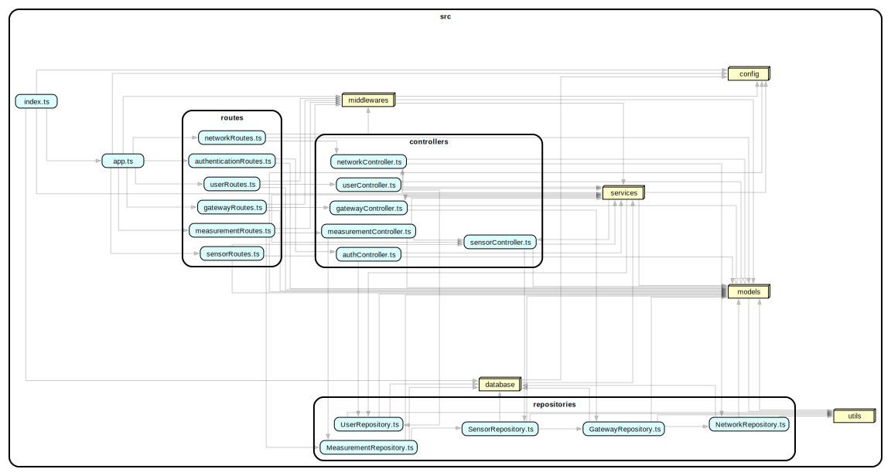

# Test Report

# Tabella dei contenuti

- [Test Report](#test-report)
- [Tabella dei contenuti](#tabella-dei-contenuti)
- [Grafo delle dipendenze](#grafo-delle-dipendenze)
- [Flusso di dipendenze](#flusso-di-dipendenze)
- [Integration approach](#integration-approach)
- [Tests](#tests)
  - [Authentication](#authentication)
  - [Users](#users)
  - [Networks](#networks)
  - [Gateways](#gateways)
  - [Sensors](#sensors)
  - [Measurements](#measurements)
- [Coverage](#coverage)
  - [Coverage dei FR](#coverage-dei-fr)
  - [Coverage White Box](#coverage-white-box)

# Grafo delle dipendenze

  

# Flusso di dipendenze

1. `index.ts`:
Punto di ingresso dell’applicazione. Si occupa di avviare il backend e di inizializzare l’ambiente di esecuzione.

2. `app.ts`:
Configura e avvia l’istanza principale di Express. Qui vengono montati i middleware, le routes e vengono collegate le varie componenti applicative.

3. `middlewares`:
Insieme di funzioni che intercettano le richieste HTTP prima che raggiungano le routes o i controller. Comprendono, ad esempio, autenticazione JWT, validazione dei dati, gestione degli errori e logging.

4. `routes`:
Definiscono i vari endpoint HTTP dell’API REST. Ogni route rappresenta una funzionalità esposta dal sistema (es: gestione network, sensori, utenti, ecc.) e instrada la richiesta al controller appropriato.

5. `controllers`:
Gestiscono la logica di orchestrazione tra routes e repository. Ricevono le richieste dalle routes, applicano la logica applicativa necessaria, validano i dati e interagiscono con i servizi o direttamente con i repository per accedere ai dati.

6. `services`:
Moduli che racchiudono la logica di business più complessa e riutilizzabile. Vengono invocati dai controller per eseguire operazioni che coinvolgono più repository, elaborazioni avanzate o regole di dominio.

7. `repositories`:
Implementano il pattern DAO (Data Access Object) per l’accesso ai dati. Gestiscono tutte le operazioni CRUD sulle entità del dominio (es: network, gateway, sensor, measurement) utilizzando TypeORM per interagire con il database.

8. `models`:
Definiscono la struttura delle entità e le relazioni tra le tabelle del database. Gli entity model TypeORM rappresentano il mapping tra oggetti applicativi e record del database.

9. `database`:
Modulo responsabile della configurazione e gestione della connessione al database (ad esempio, l’inizializzazione del DataSource TypeORM e la sincronizzazione dello schema).

10. `config`:
Raccolta di file di configurazione centralizzati. Qui vengono definite variabili d’ambiente, parametri di connessione al database, chiavi segrete e altre impostazioni globali.

11. `utils`:
Libreria di funzioni di utilità e helper usate in più parti del progetto (es: formattazione dati, validazioni comuni, funzioni di supporto, logging personalizzato).

# Integration approach
In GeoControl sono stati adottati tre livelli di test principali, seguendo un approccio strutturato:

 1. Unit Test
- **Descrizione:**  Si parte dalle componenti di livello più basso (repository/DAO, controller, servizi), testando ogni modulo in isolamento con l’uso di mock o stub per le dipendenze.
- **Obiettivo:**   Garantire che ogni funzione/method restituisca il risultato atteso indipendentemente dagli altri componenti.

 2. Integration Test
- **Descrizione:**  Una volta validati i singoli moduli, si passa a testare l’interazione tra più componenti (ad esempio: controller + repository, service + repository) usando istanze reali o database in-memory.
- **Obiettivo:**  Verificare che i diversi strati collaborino correttamente tra loro, senza fare mock dei livelli sottostanti.

3. End-to-End (e2e) Test
- **Descrizione:**  Si testano i flussi completi, simulando richieste HTTP reali alle routes dell’applicazione. In questa fase non vengono effettuati mock, ma viene verificato l’intero stack: route → controller → service → repository → database.
- **Obiettivo:**  Accertarsi che tutto il sistema funzioni come previsto dal punto di vista dell’utente finale.

La sequenza di test adottata è la seguente: 
1. **Test dei Repository (DAO):**
   - Test unitari dei metodi CRUD sui repository tramite TypeORM.
   - Uso di mock/stub per simulare il database.

2. **Test dei Controller:**
   - Verifica della logica applicativa dei controller.
   - Controllo dell’interazione corretta tra controller e repository.
   - Uso di mock per dipendenze esterne.

3. **Test delle Routes:**
   - Test degli endpoint HTTP definiti dalle routes.
   - Controllo che le richieste vengano instradate correttamente ai controller.
   - Gestione delle varie tipologie di richieste (GET, POST, PUT, DELETE).

4. **Integration Test:**
   - Simulazione di flussi completi tra più componenti reali (es: controller + repository).
   - Uso di database in-memory o reale.

5. **End-to-End Test:**
   - Simulazione di richieste HTTP reali senza mock.
   - Verifica dell’intero flusso applicativo, dalla richiesta alla risposta finale, coinvolgendo tutte le componenti del sistema.

Questo approccio garantisce robustezza a tutti i livelli del sistema e consente di individuare rapidamente eventuali malfunzionamenti sia nei singoli moduli che nelle loro interazioni. I flussi applicativi completi, però, vengono testati solo nelle fasi avanzate (integration/e2e test).

# Tests

## Authentication

| Test case name      | Object(s) tested | Test level       | Techniques used                                       |
| ------------------- | ---------------- | ---------------- | ----------------------------------------------------- |
| `POST /auth`        | Full Stack       | E2E              | BB/equivalence, auth/roles, boundary, error handling  |
| `getToken`          | AuthController   | unit/integration | WB - statement, BB - equivalence                      |
| `POST /api/v1/auth` | AuthRoutes       | integration      | BB - equivalence, auth validation, error responses    |
| `processToken`      | AuthService      | unit             | WB - statement, BB - equivalence, boundary, exception |

## Users

| Test case name                   | Object(s) tested | Test level       | Techniques used                                           |
| -------------------------------- | ---------------- | ---------------- | --------------------------------------------------------- |
| `GET /users`                     | Full Stack       | E2E              | BB/partitioning, role-based, auth, error handling         |
| `POST /users`                    | Full Stack       | E2E              | BB/equivalence, auth/roles, validation, conflict handling |
| `GET /users/:userName`           | Full Stack       | E2E              | BB/partitioning, role-based, not found, auth              |
| `PATCH /users/:userName`         | Full Stack       | E2E              | BB/partitioning, auth/roles, validation, error handling   |
| `getUser`                        | UserController   | unit/integration | WB - statement, BB - equivalence, exception handling      |
| `getAllUsers`                    | UserController   | unit/integration | WB - statement, BB - boundary                             |
| `createUser`                     | UserController   | unit/integration | WB - statement, BB - equivalence, conflict detection      |
| `deleteUser`                     | UserController   | unit/integration | WB - statement, BB - equivalence, not found handling      |
| `GET /api/v1/users`              | UserRoutes       | integration      | BB - equivalence partitioning, auth, error responses      |
| `POST /api/v1/users`             | UserRoutes       | integration      | BB - equivalence, input validation, boundary, conflict    |
| `GET /api/v1/users/:userName`    | UserRoutes       | integration      | BB - equivalence partitioning, not found, validation      |
| `DELETE /api/v1/users/:userName` | UserRoutes       | integration      | BB - equivalence partitioning, auth, error handling       |
| `create user`                    | UserRepository   | unit             | WB - statement, BB - equivalence, conflict, boundary      |
| `find user by username`          | UserRepository   | unit             | WB - statement, BB - equivalence, not found, boundary     |
| `get all users`                  | UserRepository   | unit             | WB - statement, BB - boundary, empty results              |
| `delete user`                    | UserRepository   | unit             | WB - statement, BB - equivalence, not found handling      |

## Networks

| Test case name                         | Object(s) tested  | Test level       | Techniques used                                                          |
| -------------------------------------- | ----------------- | ---------------- | ------------------------------------------------------------------------ |
| `GET /networks`                        | Full Stack        | E2E              | BB/partitioning, role-based, auth, pagination                            |
| `GET /networks/:networkCode`           | Full Stack        | E2E              | BB/partitioning, role-based, not found, auth                             |
| `POST /networks`                       | Full Stack        | E2E              | BB/equivalence, auth/roles, validation, conflict, boundary               |
| `PATCH /networks/:networkCode`         | Full Stack        | E2E              | BB/partitioning, auth/roles, validation, nested field ignoring           |
| `DELETE /networks/:networkCode`        | Full Stack        | E2E              | BB/partitioning, auth/roles, not found, cascade effects                  |
| `getNetworkByCode`                     | NetworkController | unit/integration | WB - statement, BB - equivalence, not found handling                     |
| `getAllNetworks`                       | NetworkController | unit/integration | WB - statement, BB - boundary, empty results                             |
| `createNetwork`                        | NetworkController | unit/integration | WB - statement, BB - equivalence, validation, conflict                   |
| `updateNetwork`                        | NetworkController | unit/integration | BB - equivalence partitioning, WB - statement, validation, nested ignore |
| `deleteNetwork`                        | NetworkController | unit/integration | WB - statement, BB - equivalence, not found, cascade                     |
| `GET /api/v1/networks`                 | NetworkRoutes     | integration      | BB - equivalence partitioning, auth, error responses                     |
| `POST /api/v1/networks`                | NetworkRoutes     | integration      | BB - boundary, input validation, conflict, auth                          |
| `GET /api/v1/networks/:networkCode`    | NetworkRoutes     | integration      | BB - equivalence partitioning, not found, auth                           |
| `PATCH /api/v1/networks/:networkCode`  | NetworkRoutes     | integration      | BB - partitioning, input check, nested ignore, error handling            |
| `DELETE /api/v1/networks/:networkCode` | NetworkRoutes     | integration      | BB - partitioning, status check, not found, auth                         |
| `get all networks`                     | NetworkRepository | unit             | WB - statement, BB - boundary, error handling, empty results             |
| `get network by code`                  | NetworkRepository | unit             | WB - statement, BB - equivalence, not found, boundary                    |
| `update network`                       | NetworkRepository | unit             | WB - statement, BB - equivalence, conflict, validation, boundary         |
| `delete network`                       | NetworkRepository | unit             | WB - statement, BB - equivalence, not found handling                     |

## Gateways

| Test case name                                       | Object(s) tested  | Test level       | Techniques used                                                       |
| ---------------------------------------------------- | ----------------- | ---------------- | --------------------------------------------------------------------- |
| `GET /networks/:networkCode/gateways`                | Full Stack        | E2E              | BB/partitioning, role-based, auth, empty results                      |
| `POST /networks/:networkCode/gateways`               | Full Stack        | E2E              | BB/equivalence, auth/roles, validation, conflict, MAC validation      |
| `GET /networks/:networkCode/gateways/:gatewayMac`    | Full Stack        | E2E              | BB/partitioning, role-based, not found, MAC validation                |
| `PATCH /networks/:networkCode/gateways/:gatewayMac`  | Full Stack        | E2E              | BB/partitioning, auth/roles, validation, conflict, MAC change         |
| `DELETE /networks/:networkCode/gateways/:gatewayMac` | Full Stack        | E2E              | BB/partitioning, auth/roles, not found, cascade effects               |
| `getGatewayByMac`                                    | GatewayController | unit/integration | WB - statement, branch, BB - equivalence, not found                   |
| `getAllGateways`                                     | GatewayController | unit/integration | WB - statement, BB - equivalence partitioning, branch, empty results  |
| `createGateway`                                      | GatewayController | unit/integration | WB - statement, BB - equivalence, validation, conflict                |
| `updateGateway`                                      | GatewayController | unit/integration | WB - statement, BB - equivalence, validation, conflict, MAC change    |
| `deleteGateway`                                      | GatewayController | unit/integration | WB - statement, BB - equivalence, not found handling                  |
| `GET /gateways`                                      | GatewayRoutes     | integration      | BB - equivalence, auth, error responses, pagination                   |
| `POST /gateways`                                     | GatewayRoutes     | integration      | BB - equivalence, BB - boundary, validation, conflict, MAC validation |
| `GET /gateways/:macAddress`                          | GatewayRoutes     | integration      | BB - equivalence, not found, MAC validation, auth                     |
| `PATCH /gateways/:macAddress`                        | GatewayRoutes     | integration      | BB - equivalence, BB - boundary, validation, conflict, error handling |
| `DELETE /gateways/:macAddress`                       | GatewayRoutes     | integration      | BB - equivalence, not found, auth, error responses                    |
| `get all gateways`                                   | GatewayRepository | unit             | WB - statement, BB - boundary, empty results, error handling          |
| `get gateway by MAC`                                 | GatewayRepository | unit             | WB - statement, BB - equivalence, not found, MAC validation           |
| `create gateway`                                     | GatewayRepository | unit             | WB - statement, BB - equivalence, conflict, validation, boundary      |
| `update gateway`                                     | GatewayRepository | unit             | WB - statement, BB - equivalence, conflict, validation, MAC change    |
| `delete gateway`                                     | GatewayRepository | unit             | WB - statement, BB - equivalence, not found handling                  |

## Sensors

| Test case name                                                          | Object(s) tested | Test level       | Techniques used                                                          |
| ----------------------------------------------------------------------- | ---------------- | ---------------- | ------------------------------------------------------------------------ |
| `GET /networks/:networkCode/gateways/:gatewayMac/sensors`               | Full Stack       | E2E              | BB/partitioning, role-based, auth, empty results, nested validation      |
| `POST /networks/:networkCode/gateways/:gatewayMac/sensors`              | Full Stack       | E2E              | BB/equivalence, auth/roles, validation, conflict, MAC validation         |
| `GET /networks/:networkCode/gateways/:gatewayMac/sensors/:sensorMac`    | Full Stack       | E2E              | BB/partitioning, role-based, not found, nested path validation           |
| `PATCH /networks/:networkCode/gateways/:gatewayMac/sensors/:sensorMac`  | Full Stack       | E2E              | BB/partitioning, auth/roles, validation, conflict, MAC change            |
| `DELETE /networks/:networkCode/gateways/:gatewayMac/sensors/:sensorMac` | Full Stack       | E2E              | BB/partitioning, auth/roles, not found, cascade effects                  |
| `getAllSensorsOfNetwork`                                                | SensorController | unit/integration | WB - statement, branch, BB boundary, empty results, network validation   |
| `getSensorByMac`                                                        | SensorController | unit/integration | WB - statement, branch, BB - equivalence, not found                      |
| `createSensor`                                                          | SensorController | unit/integration | WB - statement, branch, BB - equivalence, validation, conflict           |
| `updateSensor`                                                          | SensorController | unit/integration | WB - statement, branch, BB - equivalence, validation, MAC conflict       |
| `deleteSensor`                                                          | SensorController | unit/integration | WB - statement, branch, BB - equivalence, not found handling             |
| `GET /networks/:networkCode/gateways/:gatewayMac/sensors`               | SensorRoutes     | integration      | BB - equivalence partitioning, auth, nested validation, error responses  |
| `POST /networks/:networkCode/gateways/:gatewayMac/sensors`              | SensorRoutes     | integration      | BB - equivalence, input validation, conflict, MAC validation, boundary   |
| `GET /networks/:networkCode/gateways/:gatewayMac/sensors/:sensorMac`    | SensorRoutes     | integration      | BB - equivalence partitioning, not found, nested path validation         |
| `PATCH /networks/:networkCode/gateways/:gatewayMac/sensors/:sensorMac`  | SensorRoutes     | integration      | BB - equivalence, input validation, conflict, MAC change, error handling |
| `DELETE /networks/:networkCode/gateways/:gatewayMac/sensors/:sensorMac` | SensorRoutes     | integration      | BB - equivalence partitioning, not found, auth, cascade validation       |
| `get all sensors of a network`                                          | SensorRepository | unit             | WB - statement, BB - boundary, empty results, network validation         |
| `get all sensors of a gateway`                                          | SensorRepository | unit             | WB - statement, BB - boundary, empty results, gateway validation         |
| `get sensor by MAC address`                                             | SensorRepository | unit             | WB - statement, BB - equivalence, not found, MAC validation              |
| `create sensor`                                                         | SensorRepository | unit             | WB - statement, BB - equivalence, conflict, validation, boundary         |
| `update sensor`                                                         | SensorRepository | unit             | WB - statement, BB - equivalence, conflict, MAC change, not found        |
| `delete sensor`                                                         | SensorRepository | unit             | WB - statement, BB - equivalence, not found handling                     |

## Measurements

| Test case name                                                                     | Object(s) tested      | Test level       | Techniques used                                                                  |
| ---------------------------------------------------------------------------------- | --------------------- | ---------------- | -------------------------------------------------------------------------------- |
| `GET /networks/:networkCode/measurements`                                          | Full Stack            | E2E              | BB/partitioning, role-based, auth, query params, date validation, empty results  |
| `GET /networks/:networkCode/gateways/:gatewayMac/sensors/:sensorMac/measurements`  | Full Stack            | E2E              | BB/equivalence, auth/roles, nested validation, date filtering, empty results     |
| `GET /networks/:networkCode/outliers`                                              | Full Stack            | E2E              | BB/equivalence, auth/roles, statistical analysis, query params, empty results    |
| `GET /networks/:networkCode/gateways/:gatewayMac/sensors/:sensorMac/outliers`      | Full Stack            | E2E              | BB/equivalence, auth/roles, nested paths, statistical validation, date filtering |
| `GET /networks/:networkCode/stats`                                                 | Full Stack            | E2E              | BB/equivalence, auth/roles, statistical computation, query validation, boundary  |
| `GET /networks/:networkCode/gateways/:gatewayMac/sensors/:sensorMac/stats`         | Full Stack            | E2E              | BB/equivalence, auth/roles, nested validation, date params, zero stats handling  |
| `POST /networks/:networkCode/gateways/:gatewayMac/sensors/:sensorMac/measurements` | Full Stack            | E2E              | BB/equivalence, auth/roles, validation, date parsing, array handling, conflict   |
| `should instantiate MeasurementController with all dependencies`                   | MeasurementController | unit/integration | WB - statement, dependency injection, constructor validation                     |
| `should instantiate MeasurementController with default dependencies`               | MeasurementController | unit/integration | WB - statement, default parameter handling, constructor boundary                 |
| `getMeasurementsFromSensor`                                                        | MeasurementController | unit/integration | WB - statement, BB - equivalence, date filtering, empty results                  |
| `getMeasurementsFromNetwork`                                                       | MeasurementController | unit/integration | WB - statement, BB - equivalence, sensor filtering, query processing             |
| `getStatsFromSensor`                                                               | MeasurementController | unit/integration | WB - statement, statistical computation, zero handling, date filtering           |
| `getOutliersFromNetwork`                                                           | MeasurementController | unit/integration | BB - boundary, statistical analysis, threshold computation, empty detection      |
| `getOutliersFromSensor`                                                            | MeasurementController | unit/integration | WB - statement, outlier detection, statistical validation, threshold analysis    |
| `storeMeasurement`                                                                 | MeasurementController | unit/integration | WB - statement, validation, date parsing, conflict detection, batch processing   |
| `GET /networks/:networkCode/gateways/:gatewayMac/sensors/:sensorMac/measurements`  | MeasurementRoutes     | integration      | BB - equivalence partitioning, auth, date validation, error responses            |
| `GET /networks/:networkCode/gateways/:gatewayMac/sensors/:sensorMac/stats`         | MeasurementRoutes     | integration      | BB - equivalence partitioning, auth, query params, statistical validation        |
| `GET /networks/:networkCode/gateways/:gatewayMac/sensors/:sensorMac/outliers`      | MeasurementRoutes     | integration      | BB - equivalence partitioning, auth, statistical params, threshold validation    |
| `GET /networks/:networkCode/measurements`                                          | MeasurementRoutes     | integration      | BB - equivalence, query parameters, sensor filtering, date validation, auth      |
| `GET /networks/:networkCode/stats`                                                 | MeasurementRoutes     | integration      | BB - equivalence, query parameters, statistical computation, multi-sensor        |
| `GET /networks/:networkCode/outliers`                                              | MeasurementRoutes     | integration      | BB - equivalence, query parameters, outlier detection, statistical analysis      |
| `POST /networks/:networkCode/gateways/:gatewayMac/sensors/:sensorMac/measurements` | MeasurementRoutes     | integration      | BB - equivalence, input validation, array processing, date parsing, auth         |
| `get measurements from measurements`                                               | MeasurementRepository | unit             | WB - statement, query building, date filtering, sensor selection                 |
| `get measurements from network - specific sensors`                                 | MeasurementRepository | unit             | WB - statement, sensor filtering, query optimization, parameter handling         |
| `store measurement`                                                                | MeasurementRepository | unit             | WB - statement, entity creation, validation, persistence, relationship mapping   |
| `get measurements from sensor`                                                     | MeasurementRepository | unit             | WB - statement, sensor-specific queries, date filtering, result mapping          |

# Coverage

## Coverage dei FR

| Functional Requirement or scenario                                     | Test(s) (unit, integration, e2e) |
| ---------------------------------------------------------------------- | -------------------------------- |
| **FR1  Authentication**                                                |                                  |
| FR1.1 Authenticate user                                                | 16                               |
| **FR2  Manage users**                                                  |                                  |
| FR2.1 Retrieve all users                                               | 12                               |
| FR2.2 Create a new user                                                | 12                               |
| FR2.3 Retrieve a specific user                                         | 10                               |
| FR2.4 Delete a specific user                                           | 9                                |
| **FR3  Manage networks**                                               |                                  |
| FR3.1 Retrieve all networks                                            | 14                               |
| FR3.2 Create a new network                                             | 21                               |
| FR3.3 Retrieve a specific network                                      | 15                               |
| FR3.4 Update a network                                                 | 29                               |
| FR3.5 Delete a specific network                                        | 15                               |
| **FR4  Manage gateways**                                               |                                  |
| FR4.1 Retrieve all gateways of a network                               | 10                               |
| FR4.2 Create a new gateway for a network                               | 14                               |
| FR4.3 Retrieve a specific gateway                                      | 11                               |
| FR4.4 Update a gateway                                                 | 15                               |
| FR4.5 Delete a specific gateway                                        | 9                                |
| **FR5  Manage sensors**                                                |                                  |
| FR5.1 Retrieve all sensors of a gateway                                | 21                               |
| FR5.2 Create a new sensor for a gateway                                | 21                               |
| FR5.3 Retrieve a specific sensor                                       | 16                               |
| FR5.4 Update a sensor                                                  | 23                               |
| FR5.5 Delete a specific sensor                                         | 19                               |
| **FR6  Manage measurements**                                           |                                  |
| FR6.1 Retrieve measurements for a set of sensors of a specific network | 20                               |
| FR6.2 Retrieve statistics for a set of sensors of a specific network   | 15                               |
| FR6.3 Retrieve outliers for a set of sensors of a specific network     | 12                               |
| FR6.4 Store measurements for a specific sensor                         | 12                               |
| FR6.5 Retrieve measurements for a specific sensor                      | 13                               |
| FR6.6 Retrieve statistics for a specific sensor                        | 15                               |
| FR6.7 Retrieve outliers for a specific sensor                          | 12                               |

## Coverage White Box

  

